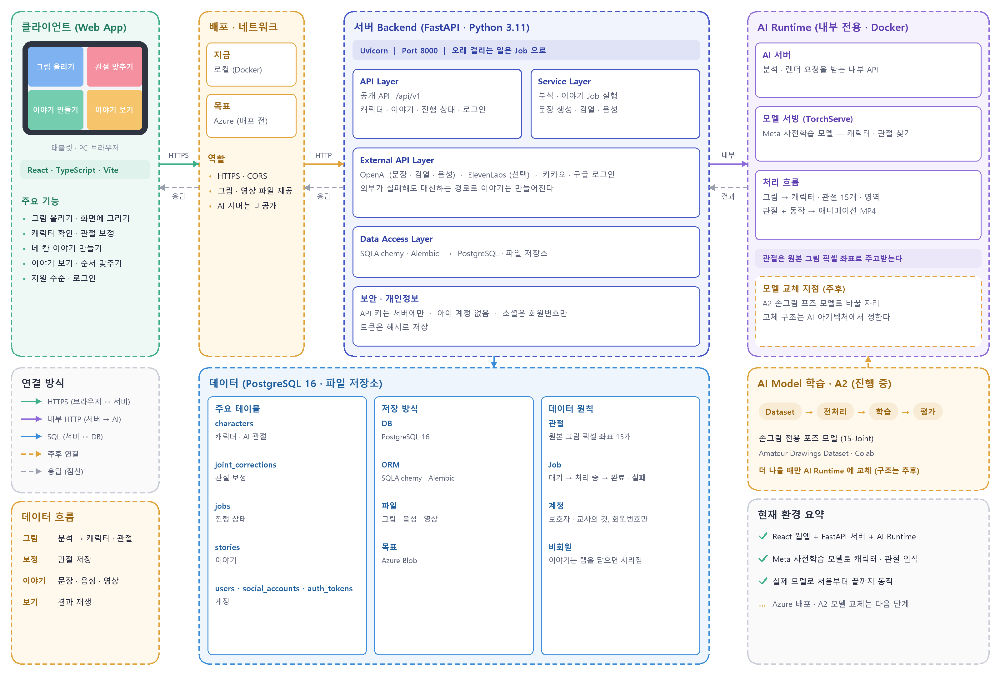
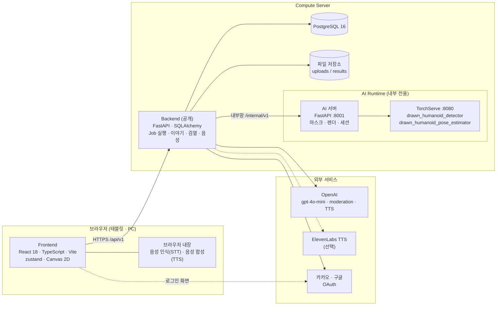
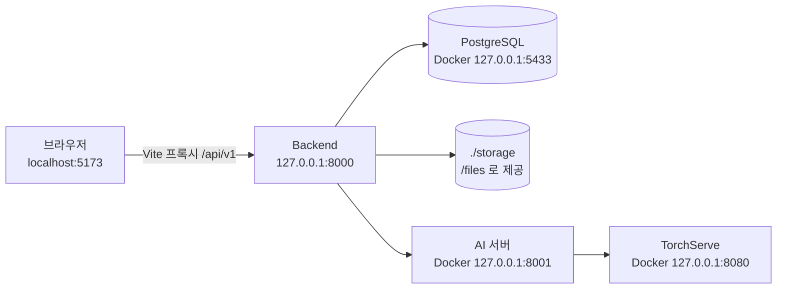
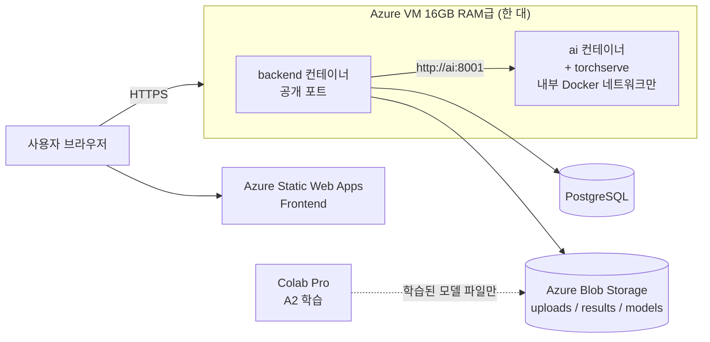
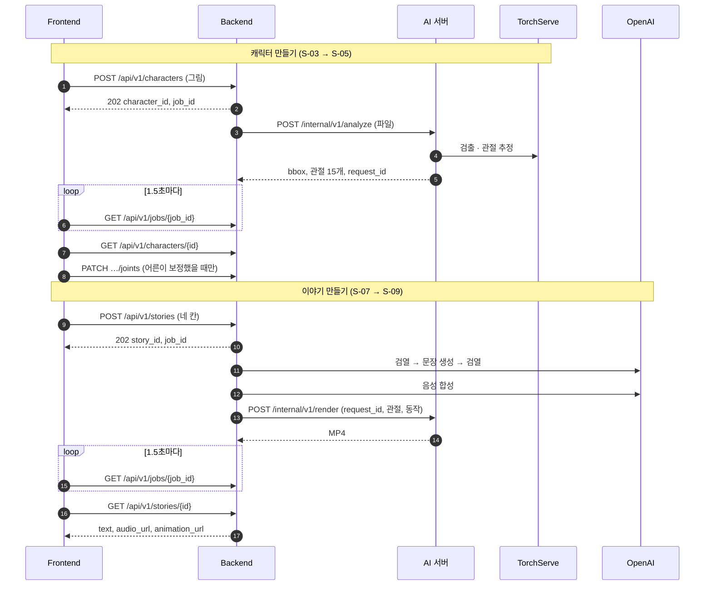

# 01. 시스템 아키텍처

| 항목 | 내용 |
|---|---|
| 문서 버전 | v0.1 (초안) |
| 기준일 | 2026-09-30 |
| 기준 코드 | 프론트 `feat/backend-contract` · 백엔드 `dev` · AI `feat/gentle-motions` |
| 근거 | 최종 인프라 구조 · 기능별 역할 정리(docx), 통합 정리 — 기술 구조와 예산(docx), 백엔드 API 계약 v0.1 |

영역 · 계층 · 연결은 다 보이게 두고 **칸마다 큰 틀만** 적은 한 장이다 (`tools/make_architecture.py`). 엔드포인트 · 모듈 · 테이블 컬럼 같은 세부는 아래 본문에 있다. AI Model 학습(A2)이 바꿀 포즈 모델의 구조는 아직 정하지 않아, 그림에는 「모델 교체 지점 (추후)」만 두었다 — 「08 AI 아키텍처」에서 다룬다.

## 한 줄 요약

**브라우저(React) → 공개 API(FastAPI) → 내부 AI 서버(FastAPI + TorchServe)** 세 층이다.
오래 걸리는 일(그림 분석, 이야기 생성)은 백엔드가 Job으로 돌리고 프론트는 상태를 묻는다.
외부 AI 업체(OpenAI 등)는 백엔드만 부르고, AI 서버는 백엔드만 부른다.

---

## 1. 구성도

---

## 2. 구성 요소

| 구성 요소 | 기술 | 맡은 일 | 저장소 |
|---|---|---|---|
| **Frontend** | React 18, TypeScript 5.6, Vite 5, react-router 6, zustand 4. 라이브러리 추가 없이 Canvas 2D | 화면 S-01~S-16, 그림 올리기·화면에 그리기, 관절 보정 UI, 브라우저 미리보기 애니메이션, Job 상태 묻기, 영상·음성 재생 | drawtale-frontend |
| **Backend** | Python 3.11, FastAPI, SQLAlchemy 2.1, Alembic, PostgreSQL 16, httpx | 공개 API, 파일 저장, Job 생성·실행, 관절 보정 저장, 이야기 문장 생성·검열, 음성 합성, AI 서버 호출, 소셜 로그인 | drawtale-backend |
| **AI 서버** | Python 3.10, FastAPI, OpenCV, Meta Animated Drawings, ffmpeg | 캐릭터 검출·관절 15개·마스크(analyze), 관절로 MP4 렌더(render), 분석 세션 보관 | drawtale-ai `runtime/` |
| **TorchServe** | Meta 사전학습 모델 (학습 없이 사용) | 사람 모양 캐릭터 검출, 관절 추정 | drawtale-ai `torchserve/` |
| **DB** | PostgreSQL 16 | 캐릭터, 관절 보정, Job, 이야기, 사용자, 소셜 계정, 토큰 | 백엔드 Alembic 마이그레이션 |
| **파일 저장소** | 지금 로컬 디스크 (`/files`로 제공). 목표 Azure Blob Storage | 올린 그림, 음성 mp3, 애니메이션 mp4 | 백엔드 `services/storage.py` |
| **모델 학습 (A2)** | Colab Pro, MMPose / RTMPose 계열 | 손그림 전용 포즈 모델 개발·평가. 기존 모델보다 나을 때만 교체 | drawtale-ai `training/` |

### 외부 서비스

| 서비스 | 쓰는 곳 | 없거나 실패하면 |
|---|---|---|
| OpenAI `gpt-4o-mini` | 네 칸을 짧은 이야기 네 문장으로 | 틀 문장 「오늘 나는 …에 갔어요. 그런데 ….」 |
| OpenAI `omni-moderation-latest` | 입력과 만든 문장을 **앞뒤로 두 번** 검사 | 걸리면 이야기를 만들지 않는다 (`CONTENT_BLOCKED`) |
| OpenAI `gpt-4o-mini-tts` 또는 ElevenLabs | 이야기 낭독 mp3 (`TTS_PROVIDER`) | 음성 없이 성공. 브라우저 음성으로 읽는다 |
| 카카오 · 구글 OAuth | 보호자·교사 로그인 (선택) | 비회원으로 쓴다 |
| 브라우저 음성 인식 (Web Speech API) | S-07 말로 덧붙이기 (어른이 켰을 때만) | 카드만으로 진행 |
| 브라우저 음성 합성 | 질문 읽기, 서버 음성이 없을 때 낭독 | 글자만 보인다 |

---

## 3. 배포 구성

### 3.1 지금 개발 구성 (로컬)

| 항목 | 값 |
|---|---|
| 프론트 | `npm run dev` (5173). `VITE_ENGINE=mock`이면 서버 없이 끝까지 돈다 |
| 백엔드 | `.venv`에서 uvicorn (8000), 또는 `docker compose --profile app up` |
| DB | `docker compose up -d db` (호스트 5433) |
| AI | drawtale-ai `docker compose up` (torchserve + ai). 백엔드 `AI_USE_MOCK=true`면 AI 없이도 돈다 |
| 확인된 것 | 실제 모델로 S-01~S-11이 끝까지 돈다 (2026-09-29) |

### 3.2 목표 배포 구성 (Azure, 아직 배포 전)

- **저장소 3개(Frontend · Backend · AI)를 유지**하고, 물리 서버는 한 대에서 컨테이너를 나눈다. 비용을 줄이되 Docker 이미지와 API 계약이 분리되어 있어 나중에 서버를 쉽게 나눌 수 있다
- 16GB는 서버 전체 메모리다. OS·Docker·Backend·AI가 함께 쓴다. 컨테이너별 상한은 실측으로 정한다 (예: Backend 2GB, AI 11~12GB)
- **AI 컨테이너는 외부에 공개하지 않는다.** 백엔드만 내부 네트워크로 부른다
- 올린 그림, 결과물, 모델 파일은 컨테이너 디스크가 아니라 영구 저장소(Blob)에 둔다
- GPU 서버를 따로 둘지는 학습 여부가 아니라 **실제 추론 지연 · 최대 메모리 · 동시 요청 성능**으로 정한다
- Blob 저장소 코드는 설정 자리(`STORAGE_BACKEND`, `AZURE_STORAGE_CONNECTION_STRING`)만 있고 아직 구현되지 않았다

---

## 4. 요청이 흐르는 길

단계별 분기는 [03. 플로우차트](03-flowchart.md)에 있다. 여기는 구성 요소 사이의 주고받기만 보인다.

| 단계 | 걸리는 시간 (실측) | 기다리는 한도 |
|---|---|---|
| 그림 분석 | 약 3~5초 | 프론트 30초 |
| 애니메이션 렌더 | 약 35~40초 (839프레임), 결과 0.6~1.7MB | 백엔드 AI 타임아웃 300초, 프론트 300초 |

---

## 5. 경계와 원칙

| 원칙 | 어떻게 지키나 |
|---|---|
| **API 키는 서버에만** | OpenAI · ElevenLabs · 카카오·구글 시크릿은 백엔드 환경변수에만 둔다. 프론트에는 소셜 client id만 |
| **화면은 업체 이름을 모른다** | 프론트는 우리 `/api/v1`만 부른다. TTS 업체가 바뀌어도 프론트는 그대로다 |
| **서버 호출은 한 곳으로** | 프론트의 모든 서버 호출은 `src/api/index.ts`를 지난다. 서버 응답 모양과 오류 코드 변환도 여기에만 있다 |
| **AI 서버는 내부 전용** | 백엔드만 `AI_SERVICE_URL`로 부른다. AI 오류 코드는 백엔드가 사용자용 문장으로 바꾼다 |
| **엔진 교체 지점은 하나** | 프론트 `VITE_ENGINE`(mock · agent · finetuned), 백엔드 `AI_USE_MOCK`. 응답 형식은 바뀌지 않는다 |
| **모델 교체는 계약 뒤에서** | A2 모델이 Meta 포즈 모델보다 실제 평가셋에서 낫고 CPU 추론이 충분할 때만 AI 서버의 포즈 부분을 바꾼다. 백엔드·프론트는 모른다 |
| **외부 장애로 멈추지 않는다** | 아래 표 |

### 무엇이 없어도 이야기는 만들어진다

| 없거나 실패한 것 | 대신 하는 것 |
|---|---|
| `OPENAI_API_KEY` 없음, 문장 생성 실패 | 틀 문장 |
| 음성 합성 실패 | `audio_url: null` → 브라우저 음성 |
| AI 서버가 순화 동작을 모름 (`UNKNOWN_MOTION`) | 원래 동작으로 다시 렌더 |
| 목 AI, 또는 AI 세션 없음 | 애니메이션 자리에 원본 그림 |
| 검열에 걸림 | **대신하지 않는다.** 이야기를 만들지 않고 아이에게 다시 고르게 한다 |

---

## 6. 데이터가 사는 곳

| 데이터 | 위치 | 비고 |
|---|---|---|
| 캐릭터 (크기, bbox, AI 관절, AI 세션 id, 모델 버전) | DB `characters` | 관절 좌표는 원본 픽셀 기준 |
| 관절 보정 이력 | DB `joint_corrections` | 가장 최근 보정을 렌더에 쓴다 |
| Job (종류, 상태, 오류 코드) | DB `jobs` | `analyze` · `story` |
| 이야기 (네 칸, 문장, 음성·영상 경로) | DB `stories` | |
| 사용자, 소셜 계정, 로그인 토큰 | DB `users` · `social_accounts` · `auth_tokens` | 제공자 회원번호만. 토큰은 SHA-256 해시 |
| 올린 그림 | 파일 `uploads/` | 원본 보관이 꺼져 있으면 지워야 한다 (아직 안 지움) |
| 음성 · 애니메이션 | 파일 `results/{story_id}.mp3 · .mp4` | |
| AI 분석 세션 (원본, 마스크, 분석 JSON) | AI 서버 작업 폴더 `request_id/` | render에서 재사용. `DELETE /internal/v1/sessions/{id}`로 정리. AI 서버를 다시 켜면 사라진다 |
| 이야기 목록, 설정, 토큰, 체험 사용 수 | 브라우저 저장소 | [04. 화면 설계서 11장](04-screen-spec.md#11-계정과-데이터) |

테이블 구조와 관계는 「10. DB ERD」 문서에서 다룬다.

---

## 7. 개인정보와 안전

| 항목 | 설계 |
|---|---|
| 아이 계정 | 없다. 계정은 보호자·교사의 것이다 |
| 소셜 로그인 | 동의 항목을 요청하지 않는다. 제공자 회원번호만 저장한다 |
| 아이 그림 | 이름·얼굴이 찍힐 수 있다. 원본 보관 기본 꺼짐, 분석 후 삭제가 목표 (백엔드 할 일) |
| 아이 목소리 | 기본 꺼짐. 어른이 켜면 브라우저 음성 인식으로 글자만 받는다. 녹음 파일은 없다 |
| 이야기 내용 | 입력과 결과를 검열한다. 무섭거나 슬픈 결말을 쓰지 않도록 문장 생성 규칙에 둔다 |
| 비회원 | 이야기는 탭을 닫으면 사라진다. 기기에는 체험 사용 수(정수 하나)만 남는다 |

---

## 8. 아직 정하지 않은 것

| 항목 | 지금 | 정할 것 |
|---|---|---|
| Azure 배포 | 로컬만 | VM 사양, 도메인, HTTPS, 배포 순서 |
| 파일 저장소 | 로컬 디스크 | Blob 구현, AI에 파일을 직접 보낼지 URL로 줄지 |
| Job 실행 | FastAPI `BackgroundTasks` (백엔드 프로세스 안) | 백엔드를 다시 켜면 진행 중 Job이 사라진다. 큐(예: 별도 워커)를 둘지 |
| AI 세션 보관 | AI 서버 디스크, 만료 규칙 없음 | 보관 기간, 이야기 생성 후 정리 |
| 원본 그림 삭제 | 지우지 않음 | 분석 직후 삭제 또는 이야기 생성 후 삭제 |
| 계정과 데이터 연결 | 로그인해도 캐릭터·이야기가 계정에 묶이지 않음 | 묶을지, 묶는다면 비회원 데이터 이전 |
| 관절 신뢰도 | AI가 값을 버림 | analyze 응답에 `score` · `confidence` 추가 |
| 동시 요청 | 측정 전 | 한 서버에서 렌더 몇 개를 동시에 돌릴 수 있는지 실측 |

---

## 9. 이어지는 문서

| 문서 | 이 문서에서 이어받는 것 |
|---|---|
| 05 소프트웨어 아키텍처 | 2장의 구성 요소를 저장소별 모듈로 나눈다 |
| 06 프로세스 아키텍처 | 4장의 Job · 렌더를 실행 단위와 동시성으로 |
| 07 서버 아키텍처 | 3장의 배포 구성을 컨테이너 · 네트워크 · 배포 절차로 |
| 08 AI 아키텍처 | AI 서버 · TorchServe 파이프라인과 A2 모델 교체 지점 |
| 09 웹앱 아키텍처 | 프론트의 화면 · 상태 · API 계층 |
| 10 DB ERD | 6장의 테이블과 관계 |
