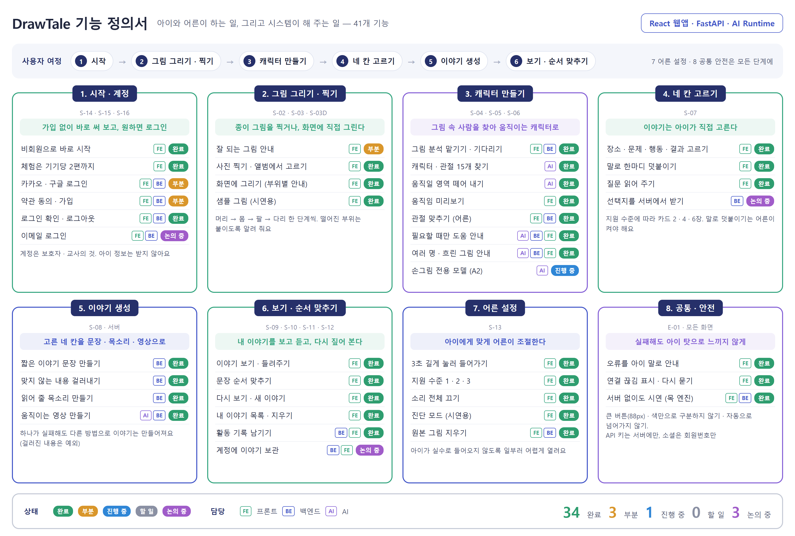

# 02. 기능 정의서

| 항목 | 내용 |
|---|---|
| 문서 버전 | v0.1 (초안) |
| 기준일 | 2026-09-30 |
| 근거 | 화면 설계서 v0.3, 백엔드 API 계약 v0.1, 팀 공유 문서 「진행 상황」 |

위 그림은 아래 「1. 기능 목록」을 사용자 여정 순서의 8개 칸으로 묶어 쉬운 말로 옮긴 한 장이다 (`tools/poster/feature-spec.html`). 기능이나 상태가 바뀌면 이 문서와 그림을 함께 고친다.

서비스 아이디어를 **구현해야 하는 기능 단위**로 나눈다. 기능마다 목적 · 사용자 입력 · 시스템 처리 · 결과 · 담당 모듈을 정하고, 화면(`S-…`)과 API에 잇는다.

## 기능 ID 규칙

`F-{영역}-{번호}`. 영역은 아래 9개다. 한 번 붙인 번호는 기능을 없애도 다시 쓰지 않는다.

| 영역 | 뜻 |
|---|---|
| `ACC` | 계정 · 시작 |
| `DRW` | 그림 입력 |
| `CHR` | 캐릭터 분석 · 보정 |
| `STY` | 이야기 만들기 |
| `PLY` | 이야기 보기 · 활동 |
| `LIB` | 보관 |
| `SET` | 어른 설정 |
| `COM` | 공통 |
| `NFR` | 비기능 요구 |

## 상태와 우선순위

| 상태 | 뜻 |
|---|---|
| 완료 | 실제 모델·서버로 끝까지 확인했다 |
| 부분 | 동작하지만 설계의 일부가 빠졌다 (비고에 무엇이 빠졌는지) |
| 할 일 | 설계는 있고 아직 만들지 않았다 |
| 논의 중 | 만들지, 어떻게 만들지 팀이 정하는 중 |
| 보류 | 지금 범위에서 뺐다 |

우선순위: **필수**는 MVP 발표 시연에 반드시 있어야 하는 것, **선택**은 있으면 좋은 것이다.

---

## 1. 기능 목록

| ID | 기능 | 화면 | 담당 | 우선순위 | 상태 |
|---|---|---|---|---|---|
| F-ACC-01 | 처음 실행 · 비회원 시작 | S-14 | FE | 필수 | 완료 |
| F-ACC-02 | 비회원 체험 한도 (기기당 2편) | S-01, S-11, S-14 | FE | 필수 | 완료 |
| F-ACC-03 | 소셜 로그인 (카카오 · 구글) | S-15, S-15C | FE · BE | 선택 | 부분 |
| F-ACC-04 | 가입 · 약관 동의 | S-16 | FE · BE | 선택 | 부분 |
| F-ACC-05 | 이메일 로그인 · 가입 | S-15, S-16 | FE · BE | 선택 | 논의 중 |
| F-ACC-06 | 로그인 확인 · 로그아웃 | S-13 | FE · BE | 선택 | 완료 |
| F-DRW-01 | 그림 그리기 안내 | S-02 | FE | 필수 | 부분 |
| F-DRW-02 | 사진 찍기 · 앨범에서 고르기 | S-03 | FE | 필수 | 완료 |
| F-DRW-03 | 화면에 그리기 (부위별 안내 · 도장) | S-03D | FE | 선택 | 완료 |
| F-DRW-04 | 샘플 그림 (개발용) | S-03 | FE | 선택 | 완료 |
| F-CHR-01 | 그림 올리기 · 분석 Job | S-04 | FE · BE | 필수 | 완료 |
| F-CHR-02 | 캐릭터 검출 · 관절 15개 추정 | S-04 | AI | 필수 | 완료 |
| F-CHR-03 | 캐릭터 마스크 생성 | S-04 | AI | 필수 | 완료 |
| F-CHR-04 | 캐릭터 확인 · 움직임 미리보기 | S-05 | FE | 필수 | 완료 |
| F-CHR-05 | 관절 보정 (어른) | S-06 | FE · BE | 필수 | 완료 |
| F-CHR-06 | 관절 신뢰도로 도움 안내 | S-05, S-06 | AI · BE · FE | 선택 | 완료 |
| F-CHR-07 | 여러 명 · 흐릿한 그림 걸러내기 | E-01 | AI · BE · FE | 선택 | 완료 |
| F-CHR-08 | 손그림 전용 포즈 모델 (A2) | — | AI | 선택 | 진행 중 |
| F-STY-01 | 네 칸 카드 고르기 | S-07 | FE | 필수 | 완료 |
| F-STY-02 | 말로 덧붙이기 | S-07, S-13 | FE | 선택 | 완료 |
| F-STY-03 | 질문 읽어 주기 (안내 나레이션) | 아이 화면 전체 | FE | 필수 | 완료 |
| F-STY-04 | 이야기 문장 만들기 | S-08 | BE | 필수 | 완료 |
| F-STY-05 | 내용 검열 | S-08, E-01 | BE | 필수 | 완료 |
| F-STY-06 | 이야기 음성 만들기 | S-08 | BE | 선택 | 완료 |
| F-STY-07 | 애니메이션 렌더 (순화 동작) | S-08 | AI · BE | 필수 | 완료 |
| F-STY-08 | 선택지를 서버가 내려주기 | S-07 | BE · 기획 | 선택 | 논의 중 |
| F-PLY-01 | 이야기 보기 · 들려주기 | S-09 | FE | 필수 | 완료 |
| F-PLY-02 | 순서 맞추기 | S-10 | FE | 필수 | 완료 |
| F-PLY-03 | 완료 · 다시 보기 · 새 이야기 | S-11 | FE | 필수 | 완료 |
| F-PLY-04 | 활동 기록 남기기 | S-10 | BE · FE | 선택 | 완료 |
| F-LIB-01 | 내 이야기 목록 | S-12 | FE | 필수 | 완료 |
| F-LIB-02 | 이야기 지우기 | S-13 | FE | 필수 | 완료 |
| F-LIB-03 | 계정에 이야기 보관 | S-12 | BE · FE | 선택 | 논의 중 |
| F-SET-01 | 어른 설정 들어가기 (3초 길게) | S-01, S-13 | FE | 필수 | 완료 |
| F-SET-02 | 지원 수준 1 · 2 · 3 | S-13, 아이 화면 전체 | FE | 필수 | 완료 |
| F-SET-03 | 소리 전체 끄기 | S-13 | FE | 필수 | 완료 |
| F-SET-04 | 원본 그림 보관 · 삭제 | S-13 | FE · BE | 필수 | 완료 |
| F-SET-05 | 진단 모드 | S-04, S-08, S-13 | FE | 선택 | 완료 |
| F-COM-01 | 오류 화면 (아이 말로) | E-01 | FE | 필수 | 완료 |
| F-COM-02 | 연결 끊김 표시 · 재시도 | C-05 | FE | 선택 | 완료 |
| F-COM-03 | 엔진 전환 (목 · 실서버) | — | FE · BE | 필수 | 완료 |

---

## 2. 기능 상세

### 2.1 계정 · 시작 (ACC)

| ID | 목적 | 사용자 입력 | 시스템 처리 | 결과 | API · 담당 모듈 |
|---|---|---|---|---|---|
| F-ACC-01 | 가입 없이 서비스의 가장 강한 순간(내 그림이 움직임)을 먼저 보여 준다 | 「바로 시작하기」 | 비회원 표시를 `sessionStorage`에 둔다 | S-01로. 이후 실행에서는 S-14를 건너뛴다 | FE `store/auth.ts` |
| F-ACC-02 | 비회원이 체험해 보되 무제한 사용은 로그인으로 이끈다 | 없음 (자동) | 이야기가 **성공할 때** 사용 수 +1. S-01에서 시작할 때만 확인 | 2편을 다 쓰면 S-14 「체험을 다 썼어요」. 만드는 도중에는 끊지 않는다 | FE `TRIAL_LIMIT` |
| F-ACC-03 | 보호자·교사가 비밀번호 없이 로그인한다 | 카카오 · 구글 버튼 | 인가 코드 → 백엔드가 client secret으로 토큰 교환 → **회원번호만** 조회 → 우리 토큰 발급(서버엔 해시) | `token`, `account`. 처음 온 사람은 `409 SIGNUP_REQUIRED` → S-16 | `POST /api/v1/auth/{provider}` · BE `services/social.py`, FE `api/auth.ts` |
| F-ACC-04 | 우리 서비스 약관 동의를 제공자 동의와 따로 받는다 | 약관 체크 → 소셜로 가입 | `agreed: true`로 다시 로그인하면 계정 생성 | 가입과 동시에 로그인 | 같은 API · FE S-16 |
| F-ACC-05 | 소셜 계정이 없는 교사용 | 이메일 · 비밀번호 | **백엔드 없음.** 목 엔진에서만 동작 | — | 남길지 논의 중 |
| F-ACC-06 | 로그인 상태를 확인하고 끊는다 | 「로그아웃」 | 토큰·계정·세션·체험 수를 지운다 | S-14부터 다시 | `GET /api/v1/auth/me` · FE |

**부분인 이유:** 카카오·구글 개발자 콘솔 등록 전이라 실제 로그인은 목으로만 확인했다. 이용약관·개인정보 처리방침 문서가 없다.

### 2.2 그림 입력 (DRW)

| ID | 목적 | 사용자 입력 | 시스템 처리 | 결과 | API · 담당 모듈 |
|---|---|---|---|---|---|
| F-DRW-01 | 모델이 잘 알아보는 그림을 미리 알려 준다 | 없음 (보기) | Level 1은 「아직 어려워요」 카드를 숨긴다 | 좋아요 · 이러면 더 잘 움직여요 · 아직 어려워요 | FE S-02 |
| F-DRW-02 | 종이에 그린 그림을 가져온다 | 카메라 촬영 또는 파일 선택 | 긴 변 1600px, JPEG 0.85로 줄인다. 10MB 초과 · 이미지 아님은 받지 않고 화면에서 아이 말로 알린다 | 미리보기 → 「이 그림으로」 | FE `lib.shrink` |
| F-DRW-03 | 종이·카메라 없이, 소근육 조작이 어려워도 캐릭터를 만든다 | 머리 → 몸 → 팔 → 다리. 손으로 그리기 또는 도장 | 점선 안내, 도장은 이미 그린 부위에 붙게 찍힘, **떨어진 부위 검사** | 흰 바탕 PNG → F-DRW-02와 같은 흐름 | FE `features/draw/drawing.ts` |
| F-DRW-04 | 그림 없이 흐름을 확인한다 (개발·시연) | 「샘플 그림으로 해보기」 | 목 관절과 같은 자리에 사람을 그린다 | 목 엔진에서만 보인다 | FE `api/mock/sample.ts` |

**부분인 이유:** F-DRW-01 예시 크게 보기와 실제 예시 사진이 없다. (F-DRW-02 형식 · 용량 안내는 2026-10-02에 넣어 완료)

### 2.3 캐릭터 분석 · 보정 (CHR)

| ID | 목적 | 사용자 입력 | 시스템 처리 | 결과 | API · 담당 모듈 |
|---|---|---|---|---|---|
| F-CHR-01 | 오래 걸리는 분석을 화면이 멈추지 않게 기다린다 | 「이 그림으로」 | 파일 저장 → analyze Job 생성(`202`) → 백그라운드 실행. 프론트는 1.5초마다 상태 조회, 30초 한도 | 캐릭터 이미지 크기 + 관절 15개 | `POST /characters`, `GET /jobs/{id}`, `GET /characters/{id}` · BE `services/jobs.py` |
| F-CHR-02 | 그림 속 사람 모양 캐릭터와 관절 자리를 찾는다 | 없음 | 최대 1000px로 줄여 **검출 → 포즈 추정**(TorchServe, Meta 사전학습). 관절을 **원본 픽셀 좌표**로 돌려준다 | bbox, 관절 15개, `request_id`. 못 찾으면 `NO_CHARACTER_DETECTED` | `POST /internal/v1/analyze` · AI `analyzer.py` |
| F-CHR-03 | 움직일 영역(캐릭터만)을 떼어 낸다 | 없음 | 적응형 이진화 → 닫힘·팽창 → flood fill, 가장 큰 덩어리 하나 | 마스크를 세션에 보관 (render에서 사용) | AI `analyzer.create_mask` |
| F-CHR-04 | 아이가 「내 친구가 움직인다」를 바로 본다 | 캐릭터 누르기 | 받은 관절로 **브라우저에서** 뼈마다 그림을 잘라 돌린다 | 손 흔들기 등 미리보기. 확정하면 S-07 | FE `features/character/CharacterCanvas` |
| F-CHR-05 | AI가 잘못 짚은 관절을 어른이 바로잡는다 | 관절점 끌기 → 「다 했어요」 (잘못 옮기면 「처음 자리로 되돌리기」) | 옮긴 게 없으면 저장 안 함. 있으면 15개 전부를 원본 좌표로 전송. 서버는 보정 이력으로 저장. 되돌리기는 AI 관절(`analysis.joints`)로 | 이후 렌더는 **가장 최근 보정값**을 쓴다 | `PATCH /characters/{id}/joints` · FE S-06, BE `joint_corrections` |
| F-CHR-06 | 도움이 필요할 때만 어른을 부른다 | 없음 | AI가 관절 `score`(포즈 모델 점수) · 검출 `confidence`를 낸다. 검출 < 0.6 이거나 관절 < 0.4 가 있으면 S-05 도움 링크, S-06 은 그 관절을 빨간 점으로 | 점수를 모르면 도움 링크를 늘 보인다 | AI `feat/joint-confidence`, 계약 2-3 · FE `needsAdult` |
| F-CHR-07 | 여러 명·흐릿한 그림을 아이 말로 안내한다 | 없음 | 두 번째 검출 ≥ 0.8 이고 50% 미만 겹치면 `MULTIPLE_CHARACTERS`, 관절 점수 평균 < 0.35 면 `LOW_CONFIDENCE`. 많이 흐린 사진은 검출이 안 돼 `NO_CHARACTER_DETECTED` | E-01 | AI `analyzer.py`, 계약 3-2 |
| F-CHR-08 | 아이들의 다양한 그림에서도 관절을 더 잘 찾는다 | 없음 | 공개 손그림 데이터셋으로 별도 포즈 모델 학습·평가. **기존 모델보다 나을 때만** 포즈 부분을 교체 | 교체되어도 계약은 그대로 | AI `training/` (A2) |

### 2.4 이야기 만들기 (STY)

| ID | 목적 | 사용자 입력 | 시스템 처리 | 결과 | API · 담당 모듈 |
|---|---|---|---|---|---|
| F-STY-01 | **아이가 이야기를 구성한다** (원인과 결과의 순서) | 장소 → 문제 → 행동 → 결과, 카드 하나씩 | 지원 수준별 2·4·6장. Level 1은 「이걸로 할까요?」 확인. 앞 칸을 바꾸면 뒤 칸 초기화 | 네 칸의 라벨 | FE S-07, `features/story/choices.ts` |
| F-STY-02 | 카드만으로는 좁은 이야기에 아이의 말을 더한다 | 「누르고 말하기」 (문제·행동·결과) | 브라우저 음성 인식 → 50자 → 그 말이 들어간 문장을 읽어 준다. **어른이 켜야만** | 그 칸은 카드 라벨 대신 아이 말을 보낸다 | FE `features/story/voice.ts` |
| F-STY-03 | 글자를 읽지 않아도 진행한다 | 없음 / 다시 듣기 | 브라우저 음성 합성. Level 3은 자동으로 읽지 않는다. 소리 끄기면 읽지 않는다 | | FE `lib.speak` |
| F-STY-04 | 아이가 고른 네 칸을 쉬운 문장으로 잇는다 | 없음 | gpt-4o-mini. **정확히 네 문장, 15~25자, 쉬운 낱말, 주인공 「나」, 「~어요」, 무섭거나 슬픈 결말 금지**. 키가 없거나 실패하면 틀 문장 | `text` | BE `services/story_writer.py` |
| F-STY-05 | 아이에게 부적절한 내용이 이야기에 들어가지 않게 한다 | 없음 | 입력과 만든 문장을 **앞뒤로** moderation | 걸리면 `CONTENT_BLOCKED` → E-01 → 덧붙인 말을 지우고 S-07로 | BE `StoryWriter.check_input` |
| F-STY-06 | 이야기를 들려준다 | 없음 | `TTS_PROVIDER` openai(gpt-4o-mini-tts) 또는 elevenlabs | `audio_url` mp3. 실패하면 `null` (이야기는 성공) | BE `services/tts.py` |
| F-STY-07 | 아이 그림이 이야기 속에서 움직인다 | 없음 | 행동 문구로 동작을 고른다 (달려·뛰·점프·춤·운동 → `jumping_gentle`, 그 밖 → `wave_hello_gentle`). 보정 관절 + 세션의 마스크로 렌더 → GIF → ffmpeg MP4. 순화 동작을 모르면 원래 동작으로 | `animation_url` MP4 (약 35~40초) | `POST /internal/v1/render` · BE `motion_for`, AI `renderer.py` |
| F-STY-08 | 선택지와 아이콘을 한곳에서 관리한다 | 없음 | `GET /api/v1/story-options` 같은 엔드포인트, 코드 값으로 주고받기 | 논의 중 | 계약 2-5 ⚠ |

### 2.5 이야기 보기 · 활동 (PLY)

| ID | 목적 | 사용자 입력 | 시스템 처리 | 결과 | API · 담당 모듈 |
|---|---|---|---|---|---|
| F-PLY-01 | 내 그림이 주인공인 이야기를 보고 듣는다 | 「들려주기」 · 「반복」 | MP4 반복 재생. 음성 파일이 있으면 그것을, 없으면 한 문장씩 읽으며 **배경 블록으로 짚는다** | | `GET /stories/{id}` · FE S-09 |
| F-PLY-02 | 이야기 순서를 되짚어 원인과 결과를 이해한다 | 카드 고르기 → 자리 고르기 (탭 두 번) | 문장을 섞어 놓는다 (Level 1은 2장). 다 채우면 판정 | 맞으면 S-11, 틀리면 원위치 (부정 표현 없음) | FE S-10 |
| F-PLY-03 | 성취를 확인하고 이어 간다 | 다시 보기 · 새 이야기 · 처음으로 | 새 이야기는 **같은 캐릭터로** S-07부터. 비회원이면 한 번 안내 | | FE S-11 |
| F-PLY-04 | 교사가 아이의 활동을 돌아본다 | 없음 | S-10 한 번마다 시도 횟수 · 완료 여부 · 카드 수 · 지원 수준 저장 | 서버에 쌓인다. 보여 주는 화면은 아직 | `POST/GET /stories/{id}/activity` · BE `story_activities` |

### 2.6 보관 (LIB)

| ID | 목적 | 사용자 입력 | 시스템 처리 | 결과 | API · 담당 모듈 |
|---|---|---|---|---|---|
| F-LIB-01 | 만든 이야기를 다시 본다 | 목록에서 고르기 | 비회원 `sessionStorage`, 회원 `localStorage` | 「{장소}에 간 날」 목록 → S-09 | FE `store/library.ts` |
| F-LIB-02 | 어른이 이야기를 정리한다 | 「삭제」 + 확인 | 기기 목록에서 지운다 | 아이 화면에서는 지울 수 없다 | FE S-13 |
| F-LIB-03 | 기기가 바뀌어도 이야기를 이어 본다 | 로그인 | 캐릭터·이야기를 계정에 묶는다 | 논의 중 | BE · FE |

### 2.7 어른 설정 (SET)

| ID | 목적 | 사용자 입력 | 시스템 처리 | 결과 | API · 담당 모듈 |
|---|---|---|---|---|---|
| F-SET-01 | 아이가 실수로 설정에 들어가지 않게 한다 | 설정 버튼 **3초 길게** | 누르는 동안 테두리가 차오른다. 짧게 누르면 안내 | S-13 | FE S-01 |
| F-SET-02 | 아이마다 다른 학습 속도와 표현 방식에 맞춘다 | 1 · 2 · 3 | 화면을 세 벌 만들지 않고 설정값·CSS 변수만 바꾼다 | 선택지 수, 아이콘 크기, 글자, 자동 읽기, 확인 단계 | FE `LEVEL_CONFIG` |
| F-SET-03 | 교실에서 소리를 끈다 | 토글 | 모든 음성·효과음 끔 | | FE |
| F-SET-04 | 아이 그림을 필요 이상 남기지 않는다 | 토글 (기본 꺼짐) | 꺼져 있으면 그림을 떠날 때 업로드 파일 · AI 사본을 지운다. 요청이 없어도 24시간 뒤, 분석 실패는 바로 | 관절 · 이야기는 남는다 | `keep_original`, `DELETE /characters/{id}/original` · FE `originals.ts` |
| F-SET-05 | 시연·개발 때 무엇이 도는지 본다 | 토글 | S-04·S-08에 상태·시간·엔진 이름 | | FE |

### 2.8 공통 (COM)

| ID | 목적 | 처리 | API · 담당 모듈 |
|---|---|---|---|
| F-COM-01 | 실패를 아이 탓으로 느끼지 않게 알린다 | 서버 코드 → 화면 코드 7종 → 갸웃하는 삽화 + 아이 말 문장 + 코드별 다음 행동. 서버 `message`는 아이 화면에 띄우지 않는다 | FE `api/index.ts ERROR_MAP`, `lib.ERROR_TEXT` |
| F-COM-02 | 연결이 끊겨도 기다리던 일을 잃지 않는다 | 브라우저 offline 이벤트로 상단 띠. 기다리는 동안 연결이 잠깐 끊기거나 502 · 503 · 504면 대기 한도 안에서 다시 묻는다 | FE `OfflineBar`, `api/index.ts waitJob` |
| F-COM-03 | 서버 없이도 개발·시연하고, 엔진을 바꿔도 화면은 그대로 둔다 | `VITE_ENGINE=mock · agent · finetuned`, 백엔드 `AI_USE_MOCK` | FE `api/index.ts`, BE `ai_client.py` |

---

## 3. 비기능 요구 (NFR)

| ID | 요구 | 기준 | 상태 |
|---|---|---|---|
| F-NFR-01 | 응답 시간 | 분석 30초 안 (실측 3~5초), 이야기 300초 안 (렌더 실측 35~40초). 500ms 미만은 로딩 표시 없음 | 충족 |
| F-NFR-02 | 접근성 | 터치 타깃 88px(어른 60px), 간격 24px, 색만으로 구분하지 않음, 탭 두 번 조작, 선택 후 300ms 입력 차단 | 충족 (태블릿 실기기 확인 전) |
| F-NFR-03 | 아이 화면 언어 | 진단명 · 기술 용어 · 오류 코드를 쓰지 않는다. 부정 표현 대신 「아직 어려워요」 | 충족 |
| F-NFR-04 | 개인정보 최소 수집 | 아이 계정 없음, 소셜 회원번호만, 토큰 해시, 목소리 녹음 없음, 원본 그림 삭제 | 완료 |
| F-NFR-05 | 비밀 관리 | API 키·시크릿은 서버 환경변수에만, 저장소·문서·채팅에 붙이지 않는다 | 충족 |
| F-NFR-06 | 외부 장애 내성 | 문장·음성·렌더 중 하나가 실패해도 이야기를 돌려준다 (검열은 예외) | 충족 |
| F-NFR-07 | 교체 가능성 | AI 엔진·TTS 업체·포즈 모델을 바꿔도 프론트는 그대로. 계약으로만 연결 | 충족 |
| F-NFR-08 | 지원 환경 | 태블릿 가로 1024×768 기준, 세로·데스크톱 대응. 음성 인식은 크롬·사파리 | 부분 (실기기 확인 전) |
| F-NFR-09 | 비용 | 외부 업체 최소화. 관절 추정은 자체 서버, 요청당 외부 비용 없음 | 충족 |

---

## 4. 화면 × 기능 대응

| 화면 | 기능 |
|---|---|
| S-01 | F-ACC-02, F-SET-01, F-LIB-01 |
| S-02 | F-DRW-01 |
| S-03 · S-03D | F-DRW-02, F-DRW-03, F-DRW-04 |
| S-04 | F-CHR-01, F-CHR-02, F-CHR-03, F-SET-05 |
| S-05 | F-CHR-04, F-CHR-06 |
| S-06 | F-CHR-05 |
| S-07 | F-STY-01, F-STY-02, F-STY-03 |
| S-08 | F-STY-04, F-STY-05, F-STY-06, F-STY-07, F-SET-05 |
| S-09 | F-PLY-01 |
| S-10 | F-PLY-02, F-PLY-04 |
| S-11 | F-PLY-03, F-ACC-02 |
| S-12 | F-LIB-01, F-LIB-03 |
| S-13 | F-SET-02~05, F-LIB-02, F-ACC-06 |
| S-14 · S-15 · S-16 | F-ACC-01, F-ACC-03, F-ACC-04, F-ACC-05 |
| E-01 | F-COM-01, F-STY-05, F-CHR-07 |

## 5. 범위 밖

| 항목 | 이유 |
|---|---|
| 한 그림에 여러 캐릭터 | 모델이 가장 높은 하나만 쓴다. 사람형 캐릭터 한 명으로 한정 |
| AI가 이야기를 이끄는 대화형 생성 | 「구성 주체는 아이」에서 멀어진다. 검수가 어렵고 턴마다 지연·비용이 쌓인다 |
| 아이 계정 · 아이 개인정보 | 계정은 보호자·교사의 것이다 |
| 모델 재학습으로 Meta 모델 대체 | 측정으로 필요가 확인된 뒤, 기존보다 나을 때만 (F-CHR-08) |
