# 03. 플로우차트

| 항목 | 내용 |
|---|---|
| 문서 버전 | v0.1 (초안) |
| 기준일 | 2026-09-30 |
| 근거 | 화면 설계서 v0.3, 백엔드 `services/jobs.py` · `story_writer.py`, AI `runtime/ai_server`, 프론트 `src/api/index.ts` |

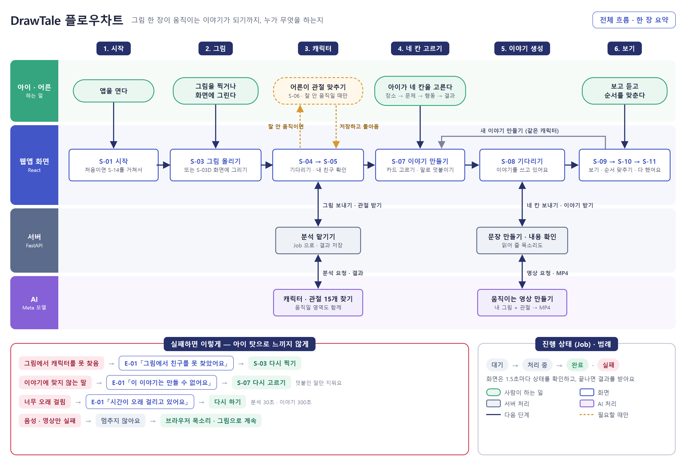

위 그림은 전체 흐름을 한 장으로 줄인 것이다 (`tools/poster/flowchart.html`). 가로는 여정 6단계, 세로는 누가 하는지(아이 · 어른 / 화면 / 서버 / AI)다. 자세한 분기는 아래 Mermaid 흐름도 10개에 그대로 있다.

사용자가 화면을 지나는 순서와, 그 뒤에서 서버가 처리하는 순서를 그린다. 그림은 Mermaid로 되어 있어 GitHub에서 바로 보인다.

| 번호 | 흐름 | 관점 |
|---|---|---|
| 1 | 전체 사용자 흐름 | 화면 |
| 2 | 처음 실행 · 로그인 | 화면 + 서버 |
| 3 | 그림 입력 | 화면 |
| 4 | 캐릭터 분석 | 서버 |
| 5 | 캐릭터 확인 · 관절 보정 | 화면 + 서버 |
| 6 | 이야기 만들기 (네 칸 + 말로 덧붙이기) | 화면 |
| 7 | 이야기 생성 | 서버 |
| 8 | 이야기 보기 · 순서 맞추기 | 화면 |
| 9 | 오류 처리 | 화면 + 서버 |
| 10 | Job 상태 | 서버 |

기호: 사각형은 화면이나 처리, 마름모는 판단, 점선 화살표는 조건부 또는 드문 길이다.

---

## 1. 전체 사용자 흐름

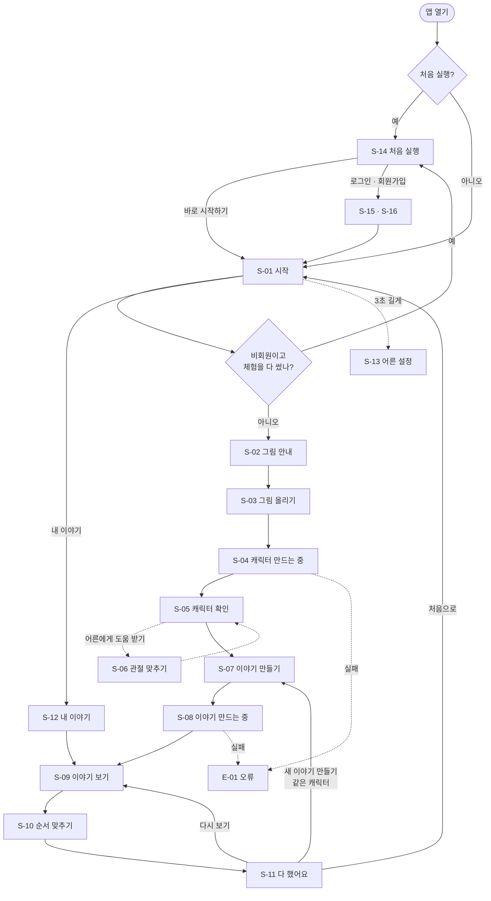

**그림 → 친구 → 이야기 → 놀이.** 아이는 네 구간을 지난다 (C-03 진행 표시). 어른은 처음 실행(S-14), 관절 보정(S-06), 설정(S-13)에서만 들어온다.

---

## 2. 처음 실행 · 로그인

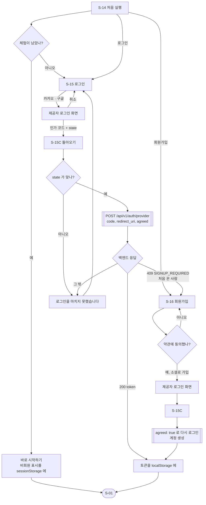

백엔드 안에서는 이렇게 처리한다.

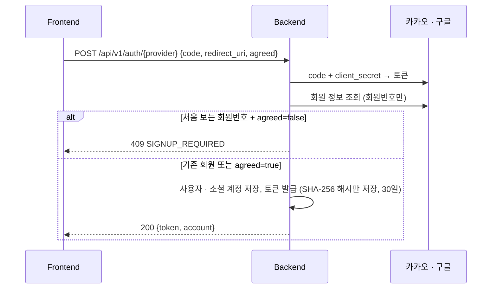

---

## 3. 그림 입력

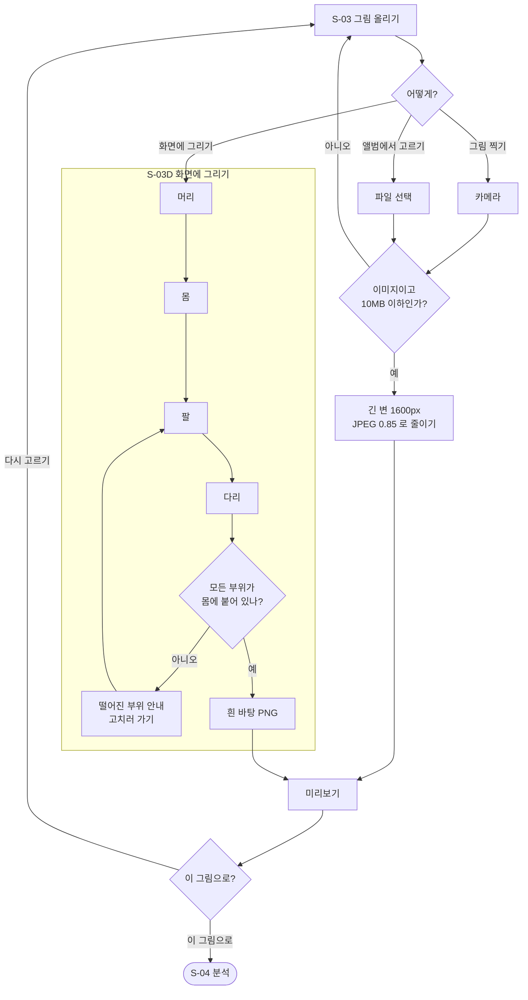

- 화면에 그리기는 단계마다 **손으로 그리기** 또는 **도장 찍기**를 고른다 (Level 1은 도장이 기본). 단계 칸을 눌러 언제든 앞 부위로 돌아간다
- 떨어진 조각을 검사하는 이유: AI는 가장 큰 덩어리 하나만 캐릭터로 쓴다. 떨어진 머리·팔은 캐릭터에서 빠진다

---

## 4. 캐릭터 분석

사용자가 올린 그림이 관절이 있는 캐릭터가 되기까지.

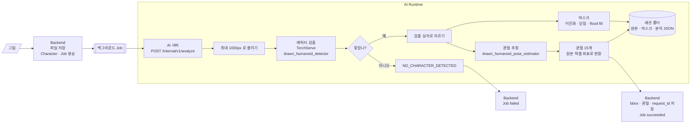

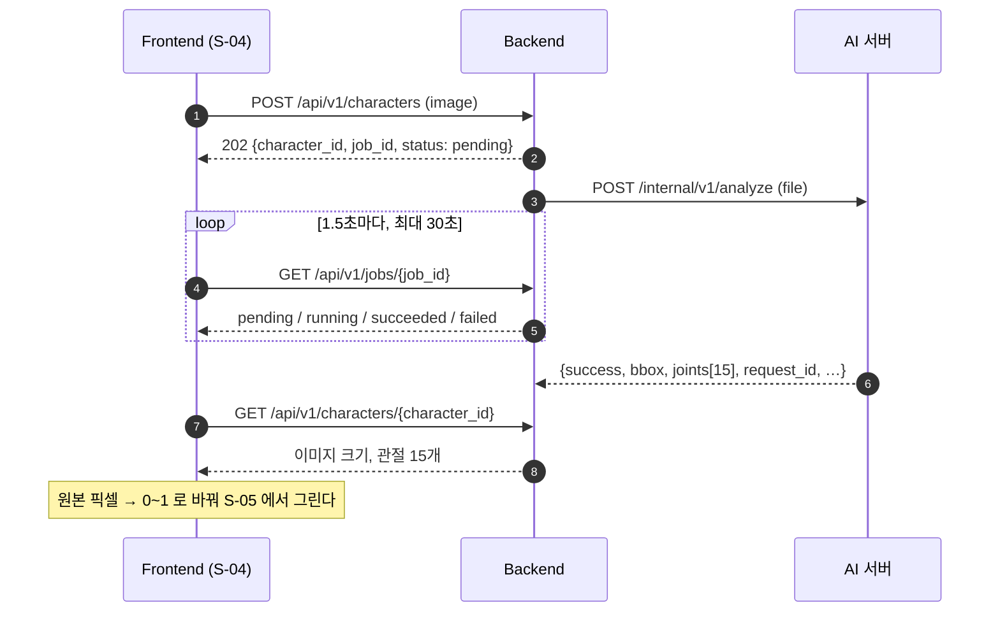

- AI의 실패는 HTTP 200 + `"success": false` + `"message": "CODE: 설명"`으로 온다. 백엔드가 `CODE`를 읽어 Job 오류 코드로 바꾼다
- 분석 세션(`request_id`)은 이야기를 만들 때 렌더에 다시 쓴다

---

## 5. 캐릭터 확인 · 관절 보정

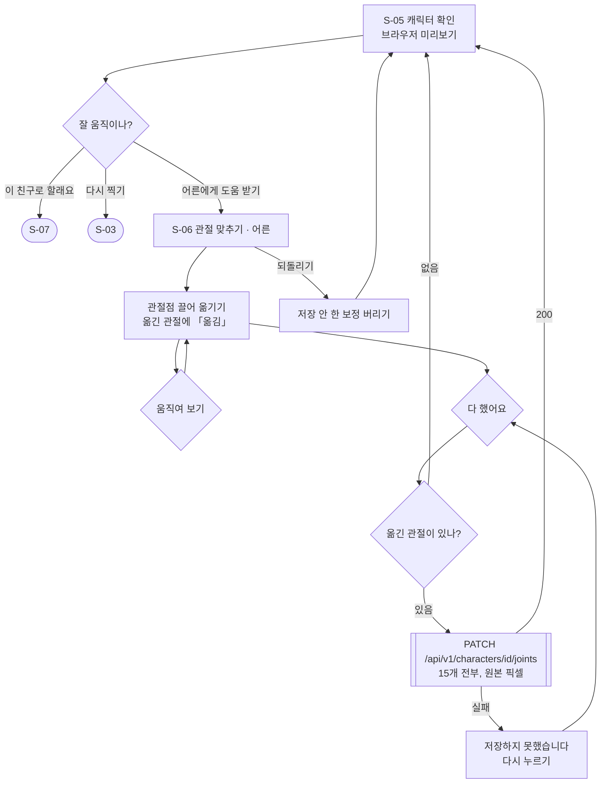

- 서버는 보정을 이력으로 쌓고, 렌더에는 **가장 최근 보정**을 쓴다. 보정이 없으면 AI 관절을 쓴다
- 되돌리기가 보정을 버리는 이유: 서버 렌더는 저장된 관절만 쓴다. 화면에만 남은 보정은 이야기에 반영되지 않는다

---

## 6. 이야기 만들기 (S-07)

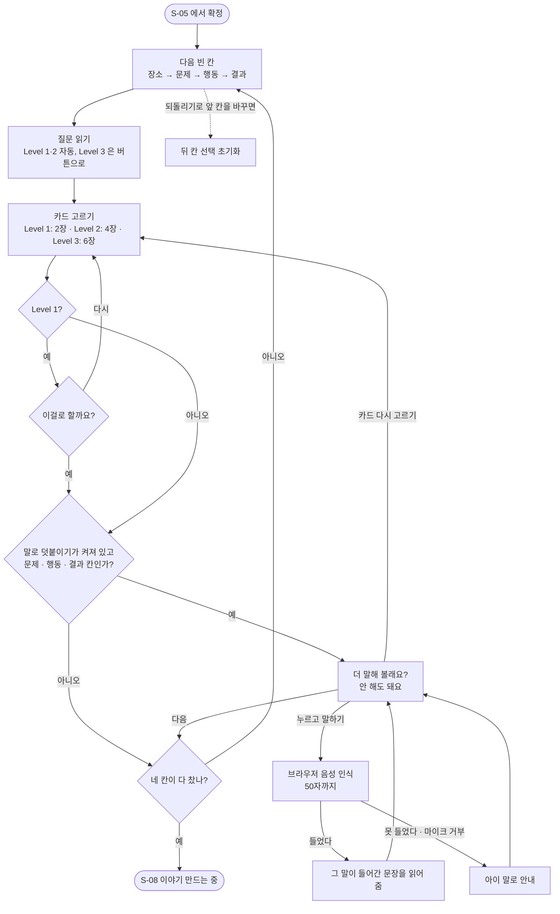

- 인물은 S-05에서 이미 정해졌으므로 고르는 칸에 없다
- 서버에는 칸마다 **카드 라벨**을, 말로 덧붙인 칸은 **아이 말**을 보낸다 (각 50자)

---

## 7. 이야기 생성 (서버)

`POST /api/v1/stories`가 만든 Job 하나 안에서 일어나는 일이다.

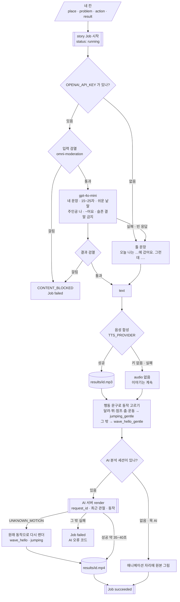

AI 서버 안의 렌더는 이렇게 흐른다.

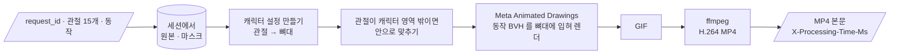

**실패해도 이야기를 돌려주는 곳과 돌려주지 않는 곳**

| 실패 | 처리 |
|---|---|
| 문장 생성 실패, 키 없음 | 틀 문장으로 계속 |
| 음성 합성 실패, 키 없음 | 음성 없이 계속 (화면은 브라우저 음성으로 읽는다) |
| AI가 순화 동작을 모름 | 원래 동작으로 다시 렌더 |
| AI 세션 없음, 목 AI | 원본 그림으로 계속 |
| **검열에 걸림** | **멈춘다.** 아이에게 다시 고르게 한다 |
| 렌더의 그 밖 실패 | 멈춘다. `ENGINE_ERROR` |

---

## 8. 이야기 보기 · 순서 맞추기

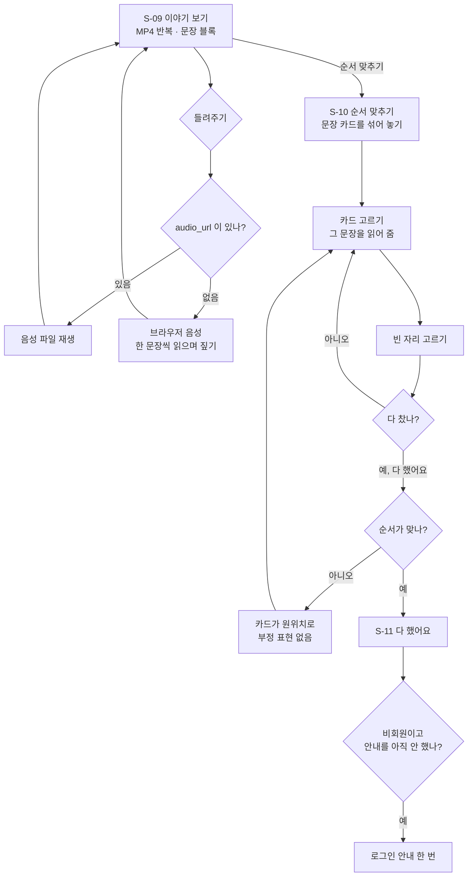

- 조작은 **탭 두 번**이 기본이다. 채워진 자리를 누르면 카드가 위로 돌아간다
- Level 1은 카드 2장

---

## 9. 오류 처리

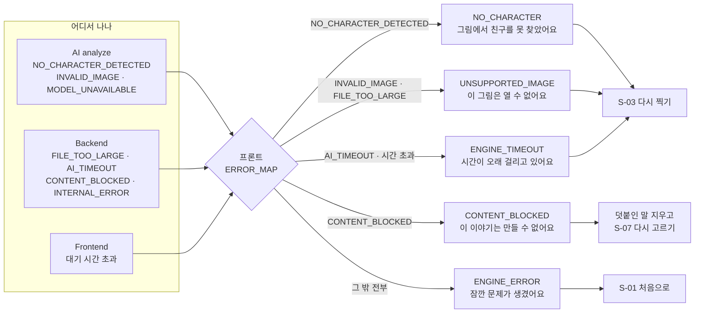

- 모든 E-01에는 2차 행동 「처음으로」가 있다
- 서버의 `message`(어른용 한국어 문장)는 아이 화면에 띄우지 않는다
- 오류가 아닌 부분 실패(음성 없음, 애니메이션 대신 그림)는 E-01로 가지 않는다 (7장)
- S-03의 형식·용량 검사, S-06의 저장 실패, S-07의 음성 인식 실패는 E-01로 가지 않고 그 화면에서 안내한다

---

## 10. Job 상태

분석과 이야기 생성은 같은 Job 모양을 쓴다 (`type`: `analyze` · `story`).

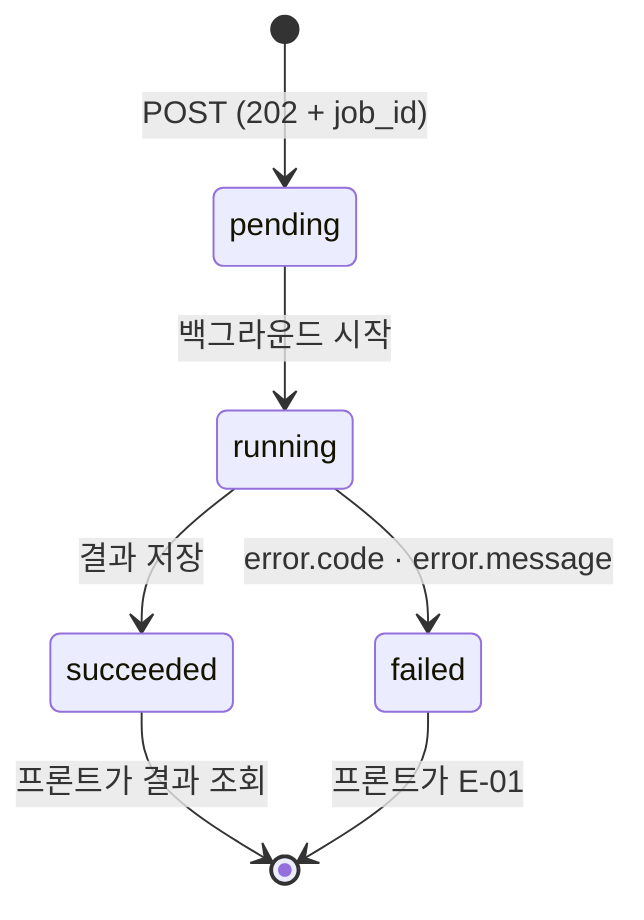

| 상태 | 프론트 처리 | 대기 점 |
|---|---|---|
| `pending` | 1.5초 뒤 다시 묻는다 | ●○○ |
| `running` | 1.5초 뒤 다시 묻는다 | ●●○ |
| `succeeded` | 묻기를 멈추고 결과를 조회한다 | ●●● |
| `failed` | 묻기를 멈추고 `error.code`로 E-01 | — |

- 프론트 대기 한도: 분석 30초, 이야기 300초. 넘으면 `ENGINE_TIMEOUT`
- 「그만하기」는 3초 뒤에 나타나고, 누르면 묻기를 멈춘다. 서버의 Job은 계속 돈다
- Job은 백엔드 프로세스 안(`BackgroundTasks`)에서 돈다. 백엔드를 다시 켜면 진행 중인 Job은 끝나지 않는다 ([01. 시스템 아키텍처](01-system-architecture.md) 8장)
