# 04. 화면 설계서

그림 기반 참여형 이야기 구성 서비스 · Frontend

| 항목 | 내용 |
|---|---|
| 문서 버전 | **v0.3** |
| 변경 사항 | 지금 구현에 맞춰 갱신. S-03D·S-14·S-15·S-16 추가, S-07 말로 덧붙이기, S-09·S-10을 서버 렌더 기준으로, 10장(서버 연동)·11장(계정과 데이터) 신설. 전체 목록은 12장 |
| 담당 | Frontend·UX |
| 기준 플랫폼 | 웹 / 태블릿 가로 1024×768 기준, 세로 및 데스크톱 대응 |
| 대상 범위 | MVP. 사람형 캐릭터 1명, 네 칸 이야기(장소·문제·행동·결과), 순화 동작 2종 |
| 기준 코드 | `drawtale-frontend` `feat/backend-contract`, 백엔드 계약 초안 v0.1 (2026-09-29) |

### 그림 읽는 법

- **S-06 관절 맞추기만 실제 캐릭터 그림**으로 보여 준다. 어른이 관절점을 끌어 맞추는 화면이라, 그림 위에 점이 어떻게 놓이는지가 설계의 핵심이다. 나머지 화면은 회색 와이어프레임이다
- 파란 동그라미 숫자는 요소표의 번호다. S-05의 ③은 `S-05-03`이다
- **점선으로 그린 요소는 조건이 맞을 때만 나타난다** (지원 수준, 오류, 비회원 등)
- 진한 버튼이 그 화면의 **주된 행동 하나**다. 흐린 버튼은 지금 누를 수 없는 상태다
- X 표시 칸은 그림(삽화·아이콘·캡처)이 들어갈 자리다
- 그림은 `tools/make_screens.py`로 만든다. 요소를 바꾸면 스크립트를 고치고 다시 만든다

---

## 1. 이 문서가 다루는 것

화면 단위의 구성 요소, 요소별 동작과 상태, 서버 연동 지점, 예외 처리를 정의한다. 시각 스타일(색, 서체, 삽화)은 프론트 저장소의 `AGENTS.md` 6장과 `docs/art-direction.md`에서 다룬다.

### 요소 번호 규칙

`화면ID-일련번호` 형식을 쓴다. 예를 들어 S-05-03은 캐릭터 확인 화면의 세 번째 요소다. 공통 컴포넌트는 `C-`로 시작하고 모든 화면에서 같은 번호를 유지한다. 한 화면 안의 다른 상태(예: S-07의 「더 말해 볼래요?」)는 번호를 이어서 붙인다.

커밋 메시지와 코드 주석에 요소 번호를 쓴다.

---

## 2. 공통 설계 원칙

| 원칙 | 내용 |
|---|---|
| 한 화면 한 질문 | 한 화면에 선택을 요구하는 요소는 하나만 둔다 |
| 글자 없이도 진행 | 질문과 선택지는 아이콘·음성 중심, 글자는 보조 |
| 자동 전환 금지 | 아이가 눌러야 다음으로 이동 |
| 위치 고정 | 되돌리기 좌상단, 다시 듣기 우상단 고정 |
| 되돌리기는 항상 있다 | 시작 화면과 분석 대기 화면을 제외한 모든 화면에서 제공 |
| 터치 타깃 | 최소 88×88px, 간격 최소 24px (어른 화면은 60px) |
| 모션 절제 | 전환 200~300ms, 장식용 움직임 없음. 움직임은 아이가 누른 것에만 답한다 |
| 소리는 끌 수 있다 | 어른 설정에서 음성 전체 끄기 가능 |
| 실패를 아이 말로 | 오류 화면에 기술 용어 노출 금지 |
| 색만으로 구분하지 않는다 | 강조는 밝기·크기·배경 블록으로. 고른 것에는 표시(✓)나 글자를 함께 둔다 |
| 구성 주체는 아이 | AI는 아이가 고른 것을 다듬고 움직이게 할 뿐, 이야기를 대신 정하지 않는다 |

### 2.1 지원 수준

어른 설정(S-13-02)에서 고른다. 화면을 세 벌 만들지 않고 CSS 변수와 설정값만 바뀐다.

| 항목 | Level 1 | Level 2 (기본) | Level 3 |
|---|---|---|---|
| 한 화면 선택지 수 | 2 | 4 | 6 |
| 아이콘 한 변 | 160px | 128px | 104px |
| 아이콘 아래 글자 | 없음 | 있음 | 있음 |
| 질문 음성 자동 재생 | 자동 | 자동 | 버튼으로만 |
| 선택 후 확인 단계 | 있음 | 없음 | 없음 |
| S-02 「아직 어려워요」 카드 | 숨김 | 보임 | 보임 |
| S-03D 처음 도구 | 도장 찍기 | 손으로 그리기 | 손으로 그리기 |
| S-05 미리보기 동작 | 손 흔들기 하나 | 누를 때마다 바뀜 | 누를 때마다 바뀜 |
| S-10 문장 카드 수 | 2 | 4 | 4 |

### 2.2 아이 화면과 어른 화면

| 구분 | 화면 | 다른 점 |
|---|---|---|
| 아이 화면 | S-01~S-05, S-07~S-12, E-01 | 터치 타깃 88px, 가운데 정렬, 질문을 읽어 준다 |
| 어른 화면 | **S-06, S-13, S-14, S-15, S-16** | 터치 타깃 60px, 글자 한 단계 작게, 왼쪽 정렬, 음성 안내 없음 |

교사·보호자가 화면을 보자마자 자기 화면인 것을 알 수 있어야 한다. 어른 설정(S-13)은 3초 길게 누르기로만 열린다. 아이가 실수로 들어가지 않게 일부러 어렵게 둔 장치다.

---

## 3. 공통 컴포넌트

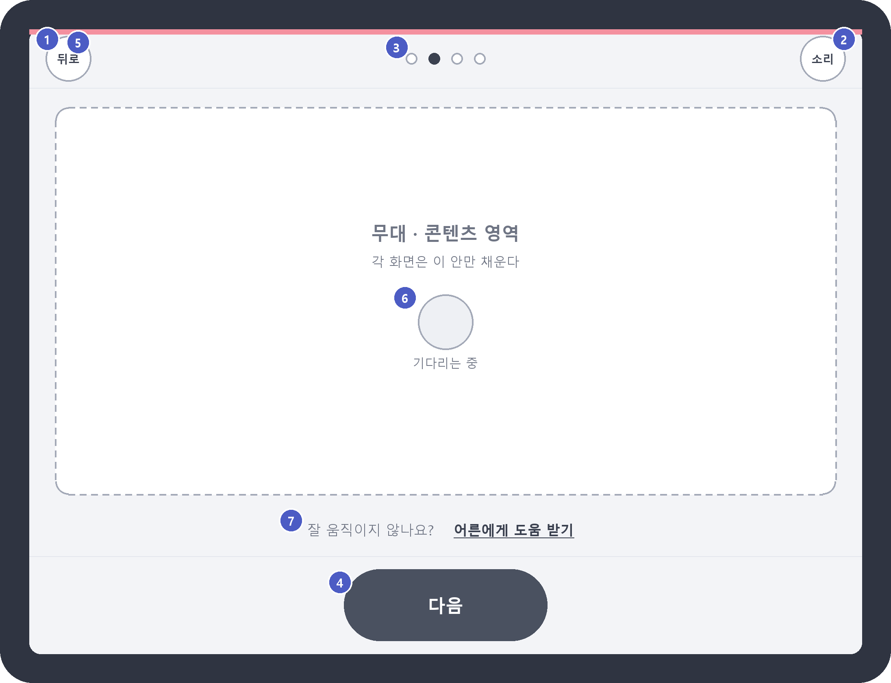

화면은 **위 레일(72px) · 가운데 무대 · 아래 행동 줄(120px)** 세 덩어리뿐이다. 모든 화면이 같은 틀(`components/Screen.tsx`)을 쓰고 무대 안만 채운다.

| No | 요소명 | 유형 | 상태 | 동작 및 예외 | 음성 |
|---|---|---|---|---|---|
| C-01 | 되돌리기 | 아이콘 버튼 88px | 기본 / 눌림 | 이전 화면으로 이동. 진행 중 선택값은 유지한다. S-01, S-14, E-01에서는 숨긴다 | 없음 |
| C-02 | 다시 듣기 | 아이콘 버튼 88px | 기본 / 재생 중 | 현재 화면의 질문 또는 문장을 다시 읽는다. 횟수 제한 없음. 읽을 문장이 없는 화면(S-12, 어른 화면)에서는 숨긴다 | 없음 |
| C-03 | 전체 진행 표시 | 표시 | 4점 중 현재 위치 | 그림 → 친구 → 이야기 → 놀이 네 구간. 숫자를 쓰지 않는다. 제목이 있는 화면(S-06, S-12, 어른 화면)은 점 대신 제목을 둔다 | 없음 |
| C-04 | 주된 행동 | 큰 버튼 | 활성 / 비활성 | 화면마다 하나. 비활성일 때 누르면 200ms 흔들려 아직 선택이 안 됐음을 알린다 | 없음 |
| C-05 | 연결 끊김 띠 | 표시 | 숨김 / 노출 | 상단 6px 띠. 브라우저가 오프라인이 되면 나타난다. 진행 중 작업은 멈추지 않는다 | 없음 |
| C-06 | 대기 표시 | 표시 | 숨김 / 노출 | S-04·S-08의 둥실거리는 삽화와 단계 점. 500ms 미만 작업에는 띄우지 않는다 | 없음 |
| C-07 | 곁들이는 링크 줄 | 글자 링크 | 조건부 | 주된 행동이 아닌 선택지는 같은 크기 버튼으로 쌓지 않고 글자 줄로 내린다 (예: 「어른에게 도움 받기」, 「로그인」) | 없음 |

### 3.1 버튼 상태 정의

| 상태 | 처리 |
|---|---|
| 기본 | 불투명도 100% |
| 눌림 | 96% 축소, 100ms |
| 비활성 | 흐린 배경, 누르면 흔들림 안내 (되돌리기·들려주기처럼 흔들 필요가 없는 버튼은 흔들지 않는다) |
| 처리 중 | 라벨을 「확인하는 중」처럼 바꾸고 연타를 막는다 |

### 3.2 C-03 진행 구간

| 구간 | 해당 화면 |
|---|---|
| 1 그림 | S-02, S-03, S-03D |
| 2 친구 | S-04, S-05 (S-06은 어른 화면이라 제목을 둔다) |
| 3 이야기 | S-07, S-08 |
| 4 놀이 | S-09, S-10, S-11 |

S-07 안에서 장소·문제·행동·결과를 나타내는 네 점은 별도 요소(S-07-04)이며 화면 하단에 둔다. 상단 점과 혼동되지 않도록 크기와 위치를 다르게 한다.

---

## 4. 화면 목록

| ID | 화면 | 경로 | 사용자 | 요소 수 | 비고 |
|---|---|---|---|---|---|
| S-01 | 시작 | `/` | 아동 | 5 | |
| S-02 | 그림 그리기 안내 | `/guide` | 아동·어른 | 6 | 지원 그림 규칙 안내 |
| S-03 | 그림 올리기 | `/upload` | 아동·어른 | 8 | 촬영, 화면에 그리기, 파일 선택 |
| **S-03D** | **화면에 그리기** | `/draw` | 아동 | 8 | **v0.3 신설.** 머리 → 몸 → 팔 → 다리 |
| S-04 | 캐릭터 만드는 중 | `/analyzing` | 아동 | 5 | 서버 분석 대기 |
| S-05 | 캐릭터 확인 | `/confirm` | 아동 | 5 | 움직임 미리보기 |
| S-06 | 관절 맞추기 | `/joints` | **어른** | 6 | 관절 15개 |
| S-07 | 이야기 만들기 | `/steps` | 아동 | 12 | 네 칸 반복 + 말로 덧붙이기 |
| S-08 | 이야기 만드는 중 | `/generating` | 아동 | 5 | 문장·음성·애니메이션 생성 대기 |
| S-09 | 이야기 보기 | `/story` | 아동 | 5 | 서버가 만든 MP4 + 낭독 |
| S-10 | 순서 맞추기 | `/order` | 아동 | 5 | 문장 카드 순서 |
| S-11 | 다 했어요 | `/done` | 아동 | 6 | 완료, 비회원 안내 |
| S-12 | 내 이야기 | `/stories` | 아동 | 3 | 이 기기에 저장된 목록 |
| S-13 | 어른 설정 | `/settings` | 교사·보호자 | 8 | 3초 길게 눌러 진입 |
| **S-14** | **처음 실행** | `/welcome` | **어른** | 6 | **v0.3 신설.** 비회원 시작 · 로그인 |
| **S-15** | **로그인** | `/login` | **어른** | 6 | **v0.3 신설.** 카카오 · 구글 |
| **S-15C** | **소셜 로그인 돌아오기** | `/auth/{provider}/callback` | **어른** | 3 | **v0.3 신설.** 로그인 흐름의 일부 |
| **S-16** | **회원가입** | `/signup` | **어른** | 7 | **v0.3 신설.** 약관 동의 |
| E-01 | 오류 공통 | `/error` | 아동 | 5 | 모달 아님, 전체 화면 |

---

## 5. 화면 흐름

자세한 분기(로그인, 오류 코드별 이동, 서버 처리)는 [03. 플로우차트](03-flowchart.md)에 있다.

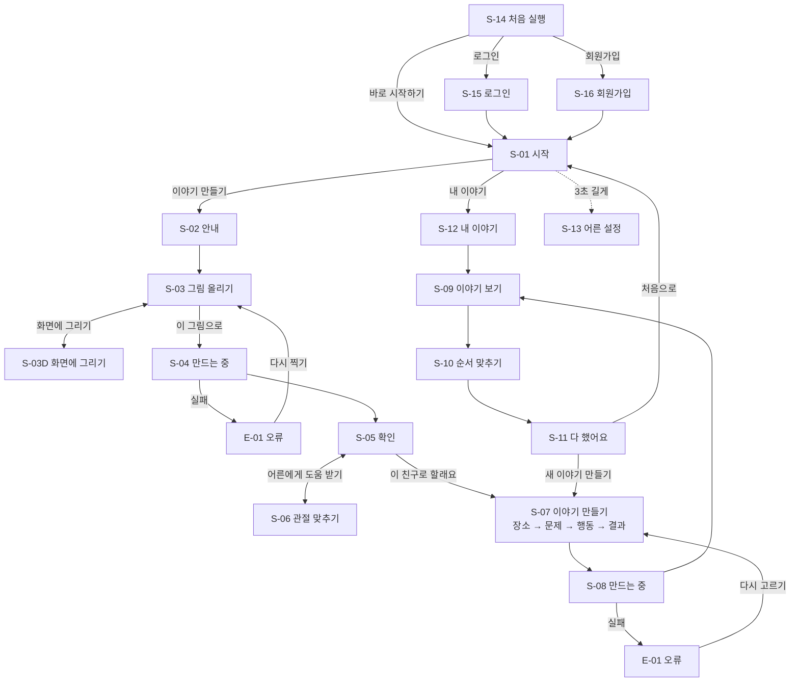
```mermaid
flowchart TD
    W[S-14 처음 실행] -->|바로 시작하기| S01
    W -->|로그인| L[S-15 로그인] --> S01
    W -->|회원가입| J[S-16 회원가입] --> S01

    S01[S-01 시작] -->|내 이야기| S12[S-12 내 이야기] --> S09
    S01 -->|이야기 만들기| S02[S-02 안내]
    S01 -.->|3초 길게| S13[S-13 어른 설정]
    S02 --> S03[S-03 그림 올리기]
    S03 <-->|화면에 그리기| S03D[S-03D 화면에 그리기]
    S03 -->|이 그림으로| S04[S-04 만드는 중]
    S04 -->|실패| E1[E-01 오류] -->|다시 찍기| S03
    S04 --> S05[S-05 확인]
    S05 <-->|어른에게 도움 받기| S06[S-06 관절 맞추기]
    S05 -->|이 친구로 할래요| S07[S-07 이야기 만들기<br/>장소 → 문제 → 행동 → 결과]
    S07 --> S08[S-08 만드는 중]
    S08 -->|실패| E2[E-01 오류] -->|다시 고르기| S07
    S08 --> S09[S-09 이야기 보기]
    S09 --> S10[S-10 순서 맞추기] --> S11[S-11 다 했어요]
    S11 -->|새 이야기 만들기| S07
    S11 -->|처음으로| S01
```

- 처음 실행할 때만 S-14를 거친다. 이후에는 바로 S-01로 간다
- **인물은 S-05에서 확정되므로 S-07의 선택 단계에 포함하지 않는다**
- S-07에서 이전 단계로 돌아가 선택을 바꾸면 이후 단계의 선택은 초기화한다

---

## 6. 화면별 요소 정의

### 6.1 S-01 시작

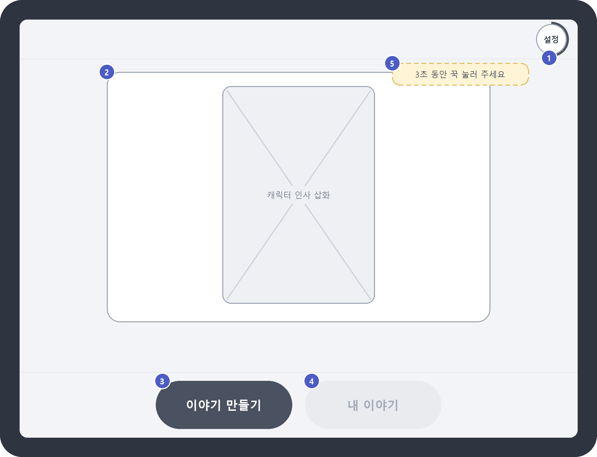

| No | 요소명 | 유형 | 상태 | 동작 및 예외 | 음성 |
|---|---|---|---|---|---|
| S-01-01 | 어른 설정 진입 | 아이콘 버튼 | 기본 | **3초 길게 누르면** S-13으로 이동한다. 누르는 동안 테두리가 차오르며 남은 시간을 보여 준다 | 없음 |
| S-01-02 | 캐릭터 인사 | 삽화 | 고정 | 손 흔드는 캐릭터 삽화 | 없음 |
| S-01-03 | 이야기 만들기 | 큰 버튼 (주된 행동) | 항상 활성 | S-02로 이동한다. **비회원이 체험 2편을 다 썼으면 S-14로 보낸다** (아이 화면에서 막지 않는다) | 없음 |
| S-01-04 | 내 이야기 | 큰 버튼 | 저장 0건이면 비활성 | S-12로 이동한다 | 없음 |
| S-01-05 | 길게 누르기 안내 | 말풍선 | 짧게 눌렀을 때만 | 3초 전에 손을 떼면 「3초 동안 꾹 눌러 주세요」를 1.8초 보여 준다 | 없음 |

진입 시 「무엇을 할까요?」를 1회 읽는다. 들어올 때마다 진행 중이던 선택(그림·캐릭터·이야기)을 비운다. 저장된 이야기 수는 서버가 아니라 이 기기의 목록(11장)에서 센다.

---

### 6.2 S-02 그림 그리기 안내

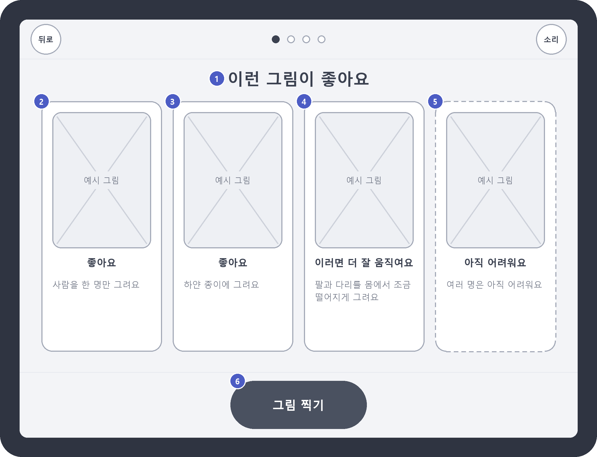

| No | 요소명 | 유형 | 상태 | 동작 및 예외 | 음성 |
|---|---|---|---|---|---|
| S-02-01 | 안내 제목 | 텍스트 | 고정 | 「이런 그림이 좋아요」 | 진입 시 자동 |
| S-02-02 | 예시 · 사람 한 명 | 이미지 카드 | 「좋아요」 | | 없음 |
| S-02-03 | 예시 · 흰 종이 | 이미지 카드 | 「좋아요」 | | 없음 |
| S-02-04 | 예시 · 팔다리 띄우기 | 이미지 카드 | 「이러면 더 잘 움직여요」 | **v0.3 추가.** 팔을 몸통에 붙여 그리면 움직일 때 팔이 뭉개진다. 권하는 것이지 강요하지 않는다 | 없음 |
| S-02-05 | 예시 · 여러 명 | 이미지 카드 | 「아직 어려워요」 | 부정 표현 대신 「아직 어려워요」로 쓴다. **Level 1에서는 숨긴다** | 없음 |
| S-02-06 | 그림 찍기 | 큰 버튼 | 항상 활성 | S-03으로 이동한다 | 없음 |

세 가지 이름표(좋아요 · 이러면 더 잘 움직여요 · 아직 어려워요)는 색만이 아니라 글자로도 구분한다. 건너뛰기 버튼은 두지 않는다. 예시 그림은 생성 이미지가 아니라 **실제로 돌려 본 그림**에서 고른다 (모델이 실제로 성공·실패하는 조건을 보여 주는 기능이기 때문이다).

---

### 6.3 S-03 그림 올리기

| 선택 전 | 선택 후 |
|---|---|
| 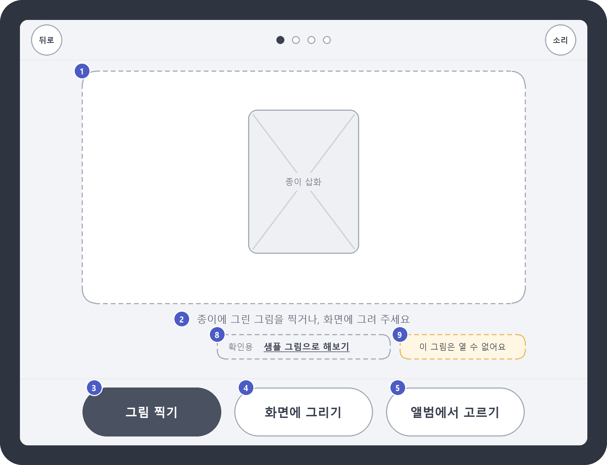 | 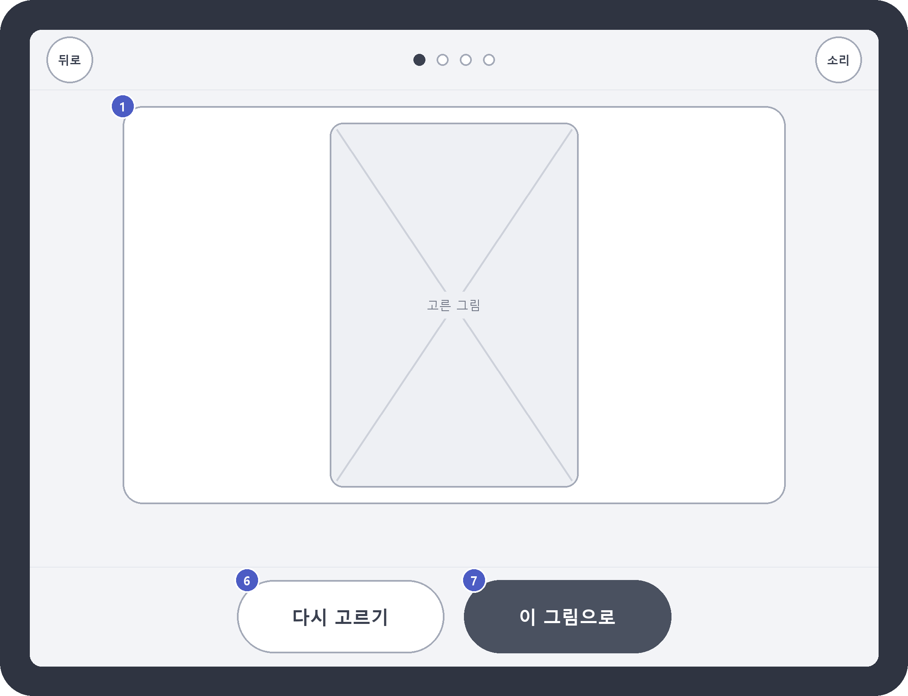 |

| No | 요소명 | 유형 | 상태 | 동작 및 예외 | 음성 |
|---|---|---|---|---|---|
| S-03-01 | 미리보기 영역 | 이미지 영역 | 비었음 / 선택됨 | 비었을 때는 점선 테두리와 종이 삽화. 선택되면 그림을 채운다 | 비었을 때 「그림을 찍어 볼까요?」, 선택 후 「이 그림으로 할까요?」 |
| S-03-02 | 안내 문구 | 텍스트 | 선택 전 | 「종이에 그린 그림을 찍거나, 화면에 그려 주세요」 | 없음 |
| S-03-03 | 그림 찍기 | 큰 버튼 (주된 행동) | 선택 전 | 태블릿에서는 카메라(`capture="environment"`)를 연다. 데스크톱에서는 파일 선택으로 대체된다 | 없음 |
| S-03-04 | 화면에 그리기 | 큰 버튼 | 선택 전 | **v0.3 추가.** S-03D로 이동한다 | 없음 |
| S-03-05 | 앨범에서 고르기 | 큰 버튼 | 선택 전 | 파일 선택 창을 연다 | 없음 |
| S-03-06 | 다시 고르기 | 버튼 | 선택 후 | 미리보기를 비우고 선택 전으로 돌아간다 | 없음 |
| S-03-07 | 이 그림으로 | 큰 버튼 (주된 행동) | 선택 후 | S-04로 이동한다. 업로드는 S-04에서 시작한다 | 없음 |
| S-03-08 | 샘플 그림으로 해보기 | 글자 링크 | **목 엔진에서만** | 그림 없이도 캐릭터가 움직이는 것까지 확인하는 개발용 기능 | 없음 |

- 클라이언트에서 **긴 변 1600px, JPEG 품질 0.85**로 줄여 보낸다. 원본은 보내지 않는다
- 10MB 초과이거나 이미지가 아니면 받지 않는다. **지금은 안내 없이 무시한다 → 9장**
- v0.2의 「업로드 진행 표시(S-03-06)」는 없앴다. 업로드와 분석을 S-04에서 한 번에 기다린다

---

### 6.4 S-03D 화면에 그리기 (v0.3 신설)

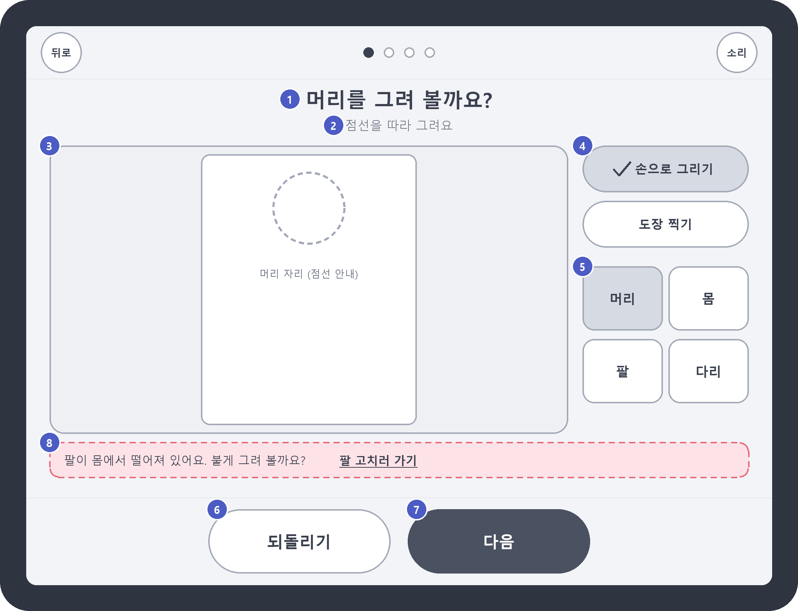

종이와 카메라가 없어도 폰·태블릿·컴퓨터에서 손가락·펜·마우스로 캐릭터를 그린다. 머리 → 몸 → 팔 → 다리를 한 단계씩, 점선 안내 위에 그리거나 도장을 찍는다.

| No | 요소명 | 유형 | 상태 | 동작 및 예외 | 음성 |
|---|---|---|---|---|---|
| S-03D-01 | 질문 | 텍스트 | 단계별 변경 | 「머리를 / 몸을 / 팔을 / 다리를 그려 볼까요?」 | 단계마다 읽어 준다 |
| S-03D-02 | 도움말 | 텍스트 | 단계·도구별 | 「점선을 따라 그려요」 또는 「점선을 누르면 모양이 찍혀요」. 팔·다리는 「몸에 붙여서」를 앞에 붙인다 | 없음 |
| S-03D-03 | 그림판 | 캔버스 | 편집 가능 | 흰 종이 4:5. 지금 부위의 자리를 점선으로 보인다. 팔 자리는 몸에서 옆으로 벌려 둔다 | 없음 |
| S-03D-04 | 도구 | 버튼 2개 | 하나 선택 | 「손으로 그리기」·「도장 찍기」. 고른 쪽은 밝은 배경 + 체크. **Level 1은 도장이 기본** | 없음 |
| S-03D-05 | 단계 칸 | 2×2 버튼 88px | 지금 / 그림 / 떨어짐 | 머리·몸·팔·다리. **누르면 그 부위로 간다.** 지금 단계는 밝은 배경, 그린 곳은 체크, 떨어진 곳은 ! 와 테두리 | 없음 |
| S-03D-06 | 되돌리기 | 버튼 | 비었으면 비활성 | 지금 단계의 마지막 획이나 도장 하나를 지운다 | 없음 |
| S-03D-07 | 다음 / 다 그렸어요 | 큰 버튼 (주된 행동) | 지금 단계가 비었으면 비활성 | 다음 부위로 간다. 마지막 단계에서는 떨어진 부위를 검사한다 | 없음 |
| S-03D-08 | 떨어짐 안내 | 안내 상자 | 떨어진 부위가 있을 때만 | 「팔이 몸에서 떨어져 있어요. 붙게 그려 볼까요?」 + 「팔 고치러 가기」 | 없음 |

- **조각이 서로 닿아야 한다.** AI는 가장 큰 덩어리 하나만 캐릭터로 쓰므로, 떨어진 조각은 빠진다 (2026-09-29 실측)
- 도장은 이미 그려진 부위에 붙는 자리에 찍힌다. 한 자리에 하나. 화면 왼쪽을 누르면 캐릭터의 오른쪽이다
- 다 그리면 흰 바탕 PNG로 만들어 S-03으로 돌아간다 → 미리보기 → 「이 그림으로」 → S-04. 사진과 같은 흐름이라 백엔드·AI 변경이 없다
- C-01 되돌리기는 이전 단계로, 첫 단계면 S-03으로. 화면을 나가면 그림은 남지 않는다

---

### 6.5 S-04 캐릭터 만드는 중

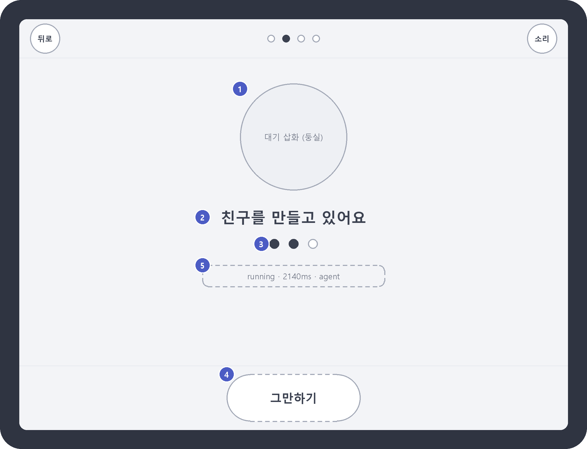

| No | 요소명 | 유형 | 상태 | 동작 및 예외 | 음성 |
|---|---|---|---|---|---|
| S-04-01 | 대기 삽화 | 삽화 | 둥실거림 | 기다리는 중이라는 것을 알리는 유일한 움직임. 실제 진행률과 연동하지 않는다 | 없음 |
| S-04-02 | 안내 문구 | 텍스트 | 고정 | 「친구를 만들고 있어요」 | 진입 시 1회 |
| S-04-03 | 단계 점 | 표시 | 3단계 | 서버 Job 상태 `pending → running → succeeded`에 맞춰 채운다. 단계 이름은 보이지 않는다 | 없음 |
| S-04-04 | 그만하기 | 버튼 | **3초 후 노출** | 요청을 취소하고 S-03으로 돌아간다. 진입 직후에는 숨겨서 실수로 누르는 것을 막는다 | 없음 |
| S-04-05 | 진단 정보 | 텍스트 | 진단 모드에서만 | 실제 상태, 경과 시간, 엔진 이름. 개발과 발표 시연에 쓴다 | 없음 |

- 연동: `POST /api/v1/characters`로 그림을 올리고, `GET /api/v1/jobs/{job_id}`를 **1.5초마다** 묻는다. 끝나면 `GET /api/v1/characters/{id}`로 관절을 받는다
- **30초**를 넘기면 E-01 `ENGINE_TIMEOUT`. Job이 `failed`면 오류 코드에 맞는 E-01로 간다 (6.15)
- 지금 코드는 C-01을 보이고, 누르면 그만하기와 같이 동작한다. 2장 원칙(분석 대기 화면에는 되돌리기 없음)과 다르다 → 9장

---

### 6.6 S-05 캐릭터 확인

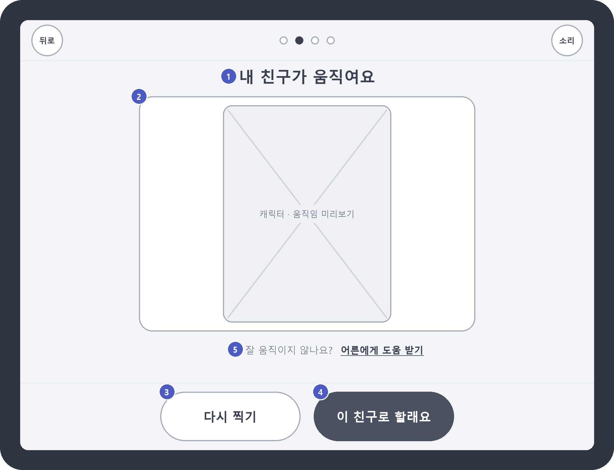

| No | 요소명 | 유형 | 상태 | 동작 및 예외 | 음성 |
|---|---|---|---|---|---|
| S-05-01 | 제목 | 텍스트 | 고정 | 「내 친구가 움직여요」 | 진입 시 자동 |
| S-05-02 | 캐릭터 미리보기 | 캔버스 | 동작 반복 | 받은 관절로 **브라우저에서 바로** 움직여 보여 준다. 누르면 다른 동작으로 바뀐다. Level 1은 손 흔들기 하나 | 없음 |
| S-05-03 | 다시 찍기 | 버튼 | 항상 활성 | S-03으로 돌아간다 | 없음 |
| S-05-04 | 이 친구로 할래요 | 큰 버튼 (주된 행동) | 항상 활성 | 캐릭터를 확정하고 S-07로 이동한다 | 없음 |
| S-05-05 | 어른에게 도움 받기 | 글자 링크 (C-07) | 항상 노출 | 「잘 움직이지 않나요?」 옆. 누르면 S-06으로 간다 | 없음 |

- 이 미리보기는 확인용이다. 이야기에 쓰는 애니메이션은 서버가 따로 렌더한다(S-09)
- v0.2는 S-05-05를 **신뢰도가 낮을 때만** 보이게 했다(`confidence < 0.6` 또는 관절 `score < 0.4`). AI 응답에 신뢰도 값이 아직 없어서 **늘 보인다 → 9장**

---

### 6.7 S-06 관절 맞추기 (어른용)

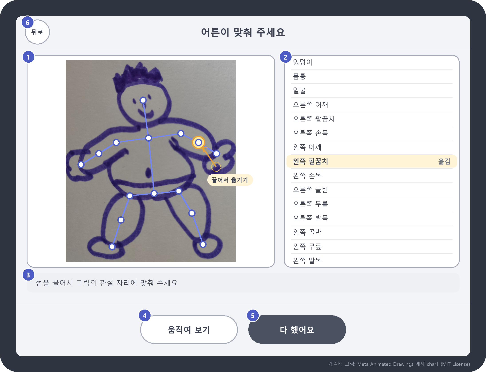

> 캐릭터 그림: Meta Animated Drawings 예제 `char1` (MIT License). 관절 위치는 그 예제의 값이다. 노란 테가 둘린 점은 AI가 잘못 짚은 자리(점선 원)에서 어른이 끌어 옮긴 왼쪽 팔꿈치다.

아이 그림은 팔이 몸에 붙어 있거나 비율이 독특해서 AI가 관절을 잘못 짚을 때가 있다. 이때 **교사나 보호자가** 그림 위의 점을 끌어 제자리에 맞춘다. 서버는 이 보정값으로 애니메이션을 렌더한다.

| No | 요소명 | 유형 | 상태 | 동작 및 예외 | 음성 |
|---|---|---|---|---|---|
| S-06-01 | 그림과 관절점 | 캔버스 | 편집 가능 | 관절점 **15개**를 포인터로 끌어 옮긴다. 점은 그림이 실제로 그려진 칸 기준으로 놓인다 (여백 제외). 점은 그림 밖으로 나가지 않는다 | 없음 |
| S-06-02 | 관절 목록 | 목록 | 스크롤 | 관절 이름 15개. **옮긴 관절에는 「옮김」**을 붙인다 | 없음 |
| S-06-03 | 안내 / 오류 상자 | 표시 | 기본 / 저장 실패 | 기본은 「점을 끌어서 그림의 관절 자리에 맞춰 주세요」. 저장에 실패하면 「저장하지 못했습니다. 「다 했어요」를 다시 눌러 주세요」 | 없음 |
| S-06-04 | 움직여 보기 / 관절 보기 | 버튼 | 토글 | 지금 좌표로 손 흔들기를 재생해 확인한다. 다시 누르면 관절 편집으로 돌아온다 | 없음 |
| S-06-05 | 다 했어요 | 큰 버튼 (주된 행동) | 저장 중 비활성 | **옮긴 관절이 없으면 저장하지 않고** S-05로 돌아간다. 있으면 15개 전부를 보내고 S-05로 돌아간다 | 없음 |
| S-06-06 | 되돌리기 (C-01) | 아이콘 버튼 | 항상 활성 | **저장하지 않은 보정을 버리고** S-05로 돌아간다. 서버 렌더는 저장된 관절만 쓰기 때문이다 | 없음 |

**관절 15개와 화면 이름**

| 관절 | 화면 이름 | 관절 | 화면 이름 |
|---|---|---|---|
| `hip` | 엉덩이 | `right_hip` | 오른쪽 골반 |
| `torso` | 몸통 | `right_knee` | 오른쪽 무릎 |
| `neck` | **얼굴** | `right_foot` | 오른쪽 **발목** |
| `right_shoulder` | 오른쪽 어깨 | `left_hip` | 왼쪽 골반 |
| `right_elbow` | 오른쪽 팔꿈치 | `left_knee` | 왼쪽 무릎 |
| `right_hand` | 오른쪽 **손목** | `left_foot` | 왼쪽 **발목** |
| `left_shoulder` | 왼쪽 어깨 | | |
| `left_elbow` | 왼쪽 팔꿈치 | | |
| `left_hand` | 왼쪽 **손목** | | |

- `neck`은 Meta 모델에서 얼굴 가운데라서 「얼굴」로, `hand`·`foot`은 실제로 손목·발목 자리라서 그렇게 적는다. **머리 관절은 없다** (브라우저 미리보기는 얼굴과 몸통 위치로 머리를 만든다)
- `right`·`left`는 **그림 속 캐릭터 기준**이다. 화면에서 보면 캐릭터의 오른손은 왼쪽에 있다
- 좌표는 원본 그림의 픽셀 기준으로 보낸다 (10장)
- 연동: `PATCH /api/v1/characters/{id}/joints`. 분석 전이면 `409 CHARACTER_NOT_READY`, 이미지 밖이면 `400 JOINT_OUT_OF_IMAGE`
- 이 화면만 어른 대상이라 문구와 조작 밀도가 다르다. 음성 안내는 쓰지 않는다
- v0.2의 「초기화」·「신뢰도 경고」·「신뢰도 낮은 관절 색 표시」는 아직 없다 → 9장

---

### 6.8 S-07 이야기 만들기

아이가 네 칸을 하나씩 채운다. 카드를 고르고, 어른 설정에서 켰다면 한마디를 말로 덧붙일 수 있다.

| 카드 고르기 | 더 말해 볼래요? |
|---|---|
| 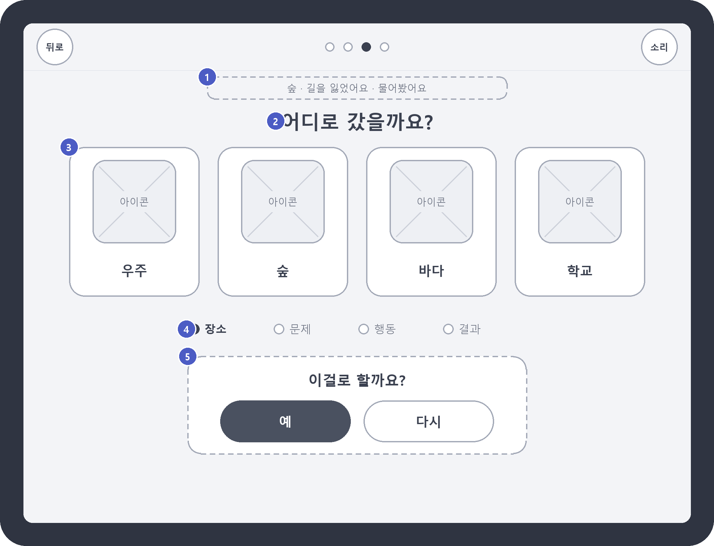 | 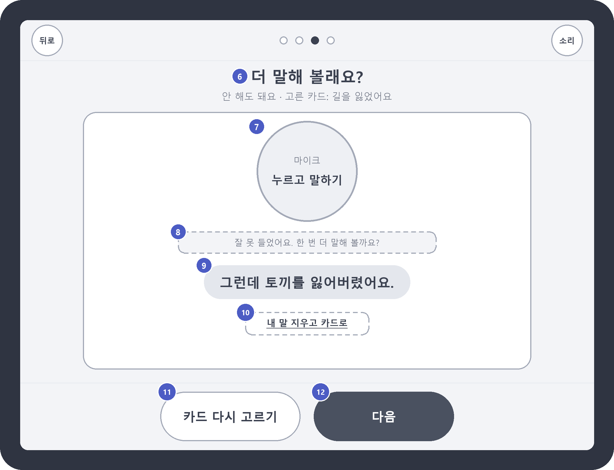 |

**카드 고르기**

| No | 요소명 | 유형 | 상태 | 동작 및 예외 | 음성 |
|---|---|---|---|---|---|
| S-07-01 | 앞 단계 요약 | 텍스트 | 결과 단계에서만 | 「숲 · 길을 잃었어요 · 물어봤어요」처럼 앞의 세 칸을 보여 준다 | 없음 |
| S-07-02 | 질문 | 텍스트 | 단계별 변경 | 장소 「어디로 갔을까요?」, 문제 「무슨 일이 생겼을까요?」, 행동 「어떻게 했을까요?」, 결과 「그래서 어떻게 됐을까요?」 | Level 1·2는 자동, Level 3은 C-02로만 |
| S-07-03 | 선택지 카드 | 카드 버튼 | 기본 / 선택됨 | 지원 수준에 따라 2·4·6개. 아이콘 + 라벨(Level 1은 라벨 없음). 누르면 다음 단계로 넘어간다. 탭 후 300ms 입력 차단 | 탭 시 라벨 읽기 |
| S-07-04 | 단계 표시 | 표시 | 4단계 | 장소·문제·행동·결과 중 현재 위치. 지금 칸은 그 단계 색으로도 보인다. 상단 C-03과 크기·위치를 다르게 한다 | 없음 |
| S-07-05 | 확인 상자 | 상자 | **Level 1만** | 「이걸로 할까요?」와 예·다시. 다시를 누르면 같은 단계에 머문다 | 「이걸로 할까요?」 |

**더 말해 볼래요?** — 어른 설정 S-13-04가 켜져 있고, 브라우저가 음성 인식을 지원하며, 문제·행동·결과 단계일 때만

| No | 요소명 | 유형 | 상태 | 동작 및 예외 | 음성 |
|---|---|---|---|---|---|
| S-07-06 | 질문 | 텍스트 | 고정 | 「더 말해 볼래요?」와 「안 해도 돼요 · 고른 카드: …」 | 「더 말해 볼래요? 안 해도 돼요.」 |
| S-07-07 | 누르고 말하기 | 원형 버튼 200px | 기본 / 듣는 중 | 누르면 브라우저 음성 인식으로 듣는다. 듣는 동안은 밝은 배경과 「듣고 있어요」로 알린다 (움직임 없음). 한 번 말하면 「다시 말하기」 | 없음 |
| S-07-08 | 못 들었을 때 안내 | 텍스트 | 실패 시 | 소리 없음 「잘 못 들었어요. 한 번 더 말해 볼까요?」, 마이크 거부 「마이크를 쓸 수 없어요. 어른에게 알려 주세요.」, 미지원 「지금은 말로 할 수 없어요. 카드만으로 해도 돼요.」 | 안내를 읽어 준다 |
| S-07-09 | 이야기 문장 | 문장 블록 | 항상 | 아이 말(없으면 카드 라벨)이 들어간 문장. 「그런데 ○○.」처럼 틀에 넣어 만든다. 누르면 다시 읽어 준다 | 말하고 나면 바로 읽어 준다 |
| S-07-10 | 내 말 지우고 카드로 | 글자 링크 | 말한 뒤에만 | 아이 말을 지우고 카드 라벨로 되돌린다 | 없음 |
| S-07-11 | 카드 다시 고르기 | 버튼 | 항상 활성 | 같은 단계의 카드 고르기로 돌아간다 | 없음 |
| S-07-12 | 다음 | 큰 버튼 (주된 행동) | 듣는 중 비활성 | 말하지 않아도 누를 수 있다. 다음 단계로 간다 | 없음 |

- **장소 단계는 말로 받지 않는다.** 「오늘 나는 ○○에 갔어요」 틀에 문장이 들어가면 깨진다
- 아이 말은 **50자**까지. 서버에는 그 단계의 카드 라벨 대신 아이 말을 보낸다. 서버의 GPT가 이야기에 녹이고 검열도 거친다
- 여기서 미리 듣는 문장은 틀로 만든 초안이라, 서버가 쓴 최종 문장과 다를 수 있다
- 아이 목소리는 브라우저 회사의 음성 인식 서버로 가서 글자가 된다. 녹음 파일은 저장하지 않는다. 그래서 **기본은 꺼짐**이고 어른이 알고 켠다
- C-01로 이전 단계에 돌아가면 그 단계의 선택은 그대로 보인다. 선택을 바꾸면 이후 단계의 선택은 초기화한다
- 선택지 목록은 지금 **프론트가 들고 있다** (장소·문제·행동·결과 각 6개). 서버가 내려줄지는 논의 중 → 9장

| 단계 | 선택지 (Level 3 기준 6개, Level 2는 앞 4개, Level 1은 앞 2개) |
|---|---|
| 장소 | 우주 · 숲 · 바다 · 학교 · 마을 · 동굴 |
| 문제 | 길을 잃었어요 · 비가 내렸어요 · 배가 고팠어요 · 어두워졌어요 · 넘어졌어요 · 혼자가 됐어요 |
| 행동 | 물어봤어요 · 달려갔어요 · 숨었어요 · 도와줬어요 · 기다렸어요 · 크게 불렀어요 |
| 결과 | 집에 갔어요 · 친구를 만났어요 · 선물을 받았어요 · 해가 떴어요 · 잠이 들었어요 · 모두 기뻐했어요 |

---

### 6.9 S-08 이야기 만드는 중

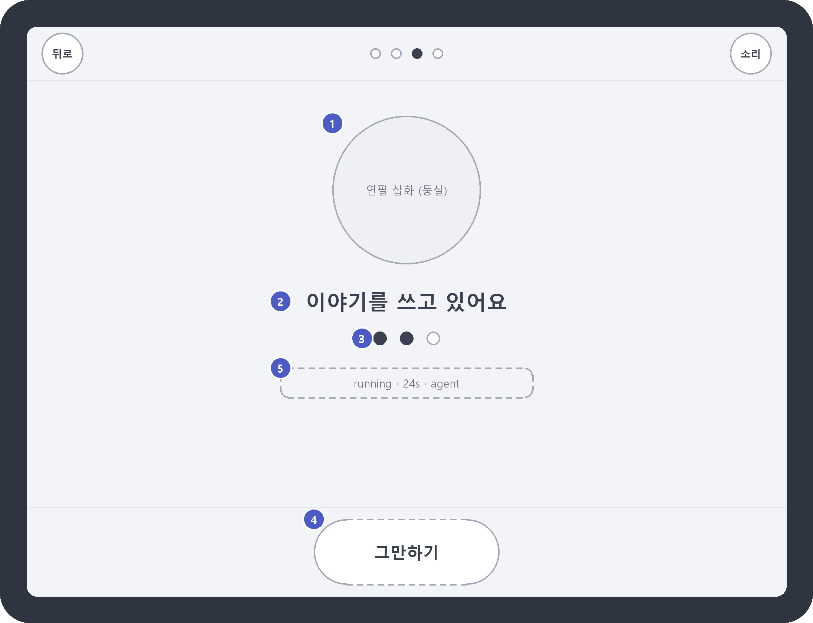

| No | 요소명 | 유형 | 상태 | 동작 및 예외 | 음성 |
|---|---|---|---|---|---|
| S-08-01 | 대기 삽화 | 삽화 | 둥실거림 | 연필 삽화 | 없음 |
| S-08-02 | 안내 문구 | 텍스트 | 고정 | 「이야기를 쓰고 있어요」 | 진입 시 1회 |
| S-08-03 | 단계 점 | 표시 | 3단계 | Job 상태 `pending → running → succeeded` | 없음 |
| S-08-04 | 그만하기 | 버튼 | 3초 후 노출 | 요청을 취소하고 S-07로 돌아간다 | 없음 |
| S-08-05 | 진단 정보 | 텍스트 | 진단 모드에서만 | 상태, 경과 초, 엔진 이름 | 없음 |

- 연동: `POST /api/v1/stories` → `GET /api/v1/jobs/{job_id}` 1.5초마다 → `GET /api/v1/stories/{id}`
- 서버가 문장 → 음성 → **애니메이션 렌더(약 35~40초)**까지 끝낸 뒤 `succeeded`가 된다. 그래서 최대 **300초** 기다린다
- **부분 실패를 전체 실패로 만들지 않는다.** 음성만 실패하면 음성 없이 성공하고 S-09는 브라우저 음성으로 읽는다. 문장 생성이 안 되면 서버가 틀 문장으로 대신한다
- 검열에 걸리면 E-01 `CONTENT_BLOCKED`
- 비회원이면 성공할 때 체험 한 편을 쓴다 (11.2)

---

### 6.10 S-09 이야기 보기

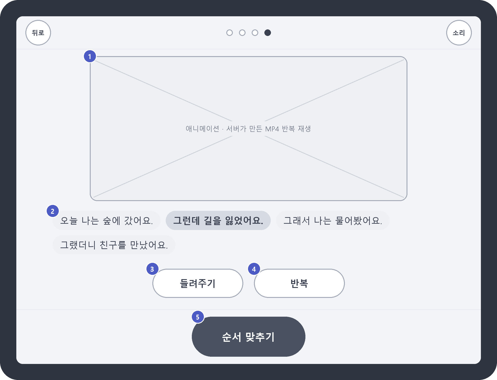

| No | 요소명 | 유형 | 상태 | 동작 및 예외 | 음성 |
|---|---|---|---|---|---|
| S-09-01 | 애니메이션 | 영상 | 반복 재생 | 서버가 만든 MP4를 소리 없이 반복한다. MP4가 없으면(목 AI) 그림을, 그림도 없으면 브라우저 미리보기를 보인다 | 없음 |
| S-09-02 | 이야기 문장 | 문장 블록 줄 | 기본 / 읽는 중 | 문장마다 블록 하나. 읽고 있는 문장은 **배경 블록**으로 짚는다 (색이 아니라) | 읽기 대상 |
| S-09-03 | 들려주기 / 멈추기 | 버튼 | 재생 / 멈춤 | 서버 음성 파일이 있으면 그것을, 없으면 브라우저 음성으로 한 문장씩 읽으며 짚는다. **소리 전체 끄기면 비활성** | 없음 |
| S-09-04 | 반복 | 버튼 | 켜짐 / 꺼짐 | 켜면 끝까지 읽은 뒤 처음부터 다시 읽는다 | 없음 |
| S-09-05 | 순서 맞추기 | 큰 버튼 (주된 행동) | 항상 활성 | 읽기를 멈추고 S-10으로 간다 | 없음 |

- 연동: `GET /api/v1/stories/{id}`의 `text` · `audio_url` · `animation_url`
- 진입할 때 자동으로 읽지 않는다. 아이가 「들려주기」를 누른다 (자동 전환 금지)
- C-01은 S-01로 간다
- v0.2의 「장면 4개 · 이전·다음 장면 · 장면 점」은 없앴다. 서버가 장면별이 아니라 **영상 하나와 문장 전체**를 주기 때문이다. 장면 배경을 어디에 넣을지는 → 9장

---

### 6.11 S-10 순서 맞추기

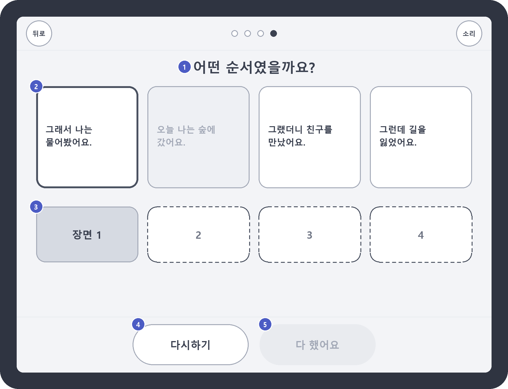

| No | 요소명 | 유형 | 상태 | 동작 및 예외 | 음성 |
|---|---|---|---|---|---|
| S-10-01 | 질문 | 텍스트 | 고정 | 「어떤 순서였을까요?」 | 진입 시 자동 |
| S-10-02 | 문장 카드 | 카드 | 기본 / 고름 / 놓음 | 이야기 문장을 섞어 놓는다. 누르면 고른 상태(굵은 테)가 되고 그 문장을 읽어 준다. 자리에 놓은 카드는 흐려진다 | 탭 시 그 문장 |
| S-10-03 | 빈 자리 | 놓는 칸 | 비었음 / 채워짐 | 카드를 고른 상태에서 누르면 그 자리에 놓인다. 채워진 자리를 누르면 카드가 위로 돌아간다 | 없음 |
| S-10-04 | 다시하기 | 버튼 | 항상 활성 | 모든 카드를 원위치로 | 없음 |
| S-10-05 | 다 했어요 | 큰 버튼 (주된 행동) | 다 차면 활성 | 맞으면 S-11로 간다. 틀리면 카드가 원위치로 돌아가고 다시 해 볼 수 있다. 부정적 표현을 쓰지 않는다 | 없음 |

- **기본 조작은 탭 두 번**(카드 고르기 → 자리 고르기)이다. 드래그만 되는 조작은 소근육 조작이 어려운 아이를 배제한다
- 카드는 **장면이 아니라 문장**이다 (서버가 `text` 한 덩어리를 준다). Level 1은 2장, 그 외는 4장
- v0.2의 「시도 기록 전송(`POST /api/stories/{id}/activity`)」은 서버에 받을 곳이 없어 보내지 않는다 → 9장

---

### 6.12 S-11 다 했어요

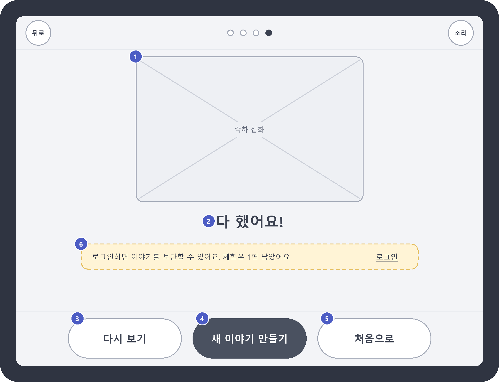

| No | 요소명 | 유형 | 상태 | 동작 및 예외 | 음성 |
|---|---|---|---|---|---|
| S-11-01 | 축하 삽화 | 삽화 | 고정 | 반복 재생하지 않는다 | 없음 |
| S-11-02 | 완료 문구 | 텍스트 | 고정 | 「다 했어요!」 | 진입 시 자동 |
| S-11-03 | 다시 보기 | 버튼 | 항상 활성 | S-09로 간다 | 없음 |
| S-11-04 | 새 이야기 만들기 | 큰 버튼 (주된 행동) | 항상 활성 | **같은 캐릭터로** S-07부터 다시 시작한다 | 없음 |
| S-11-05 | 처음으로 | 버튼 | 항상 활성 | S-01로 간다 | 없음 |
| S-11-06 | 비회원 안내 | 안내 상자 | **비회원, 한 번만** | 「로그인하면 이야기를 보관할 수 있어요. 체험은 N편 남았어요」 또는 「체험을 다 썼어요. 로그인하면 계속 만들 수 있어요」 + 「로그인」 | 없음 |

---

### 6.13 S-12 내 이야기

| 목록 | 빈 상태 |
|---|---|
| 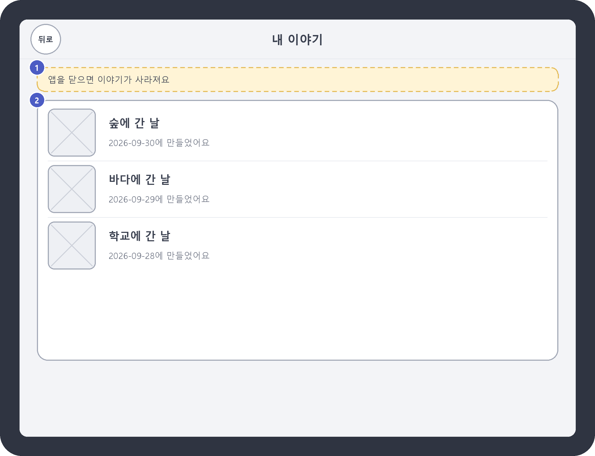 | 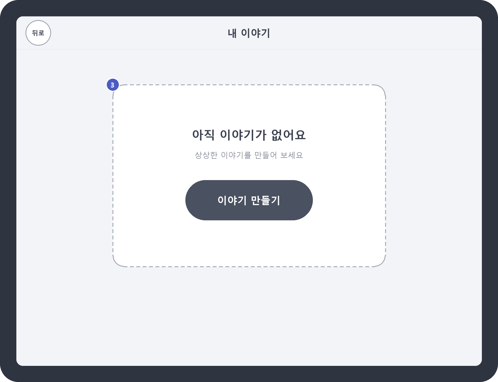 |

| No | 요소명 | 유형 | 상태 | 동작 및 예외 | 음성 |
|---|---|---|---|---|---|
| S-12-01 | 비회원 경고 | 안내 상자 | 비회원만 | 「앱을 닫으면 이야기가 사라져요」 | 없음 |
| S-12-02 | 이야기 목록 | 목록 | 스크롤 | 썸네일 자리, 제목 「{장소}에 간 날」, 만든 날짜. 누르면 S-09로 간다. 아동 화면에서는 삭제할 수 없다 | 없음 |
| S-12-03 | 빈 상태 | 표시 | 0건일 때 | 「아직 이야기가 없어요」와 「이야기 만들기」 버튼. 안내 문구만 두지 않는다 | 없음 |

목록은 서버가 아니라 **이 기기**에 저장된 것이다 (11.1). 썸네일은 아직 빈 자리다.

---

### 6.14 S-13 어른 설정

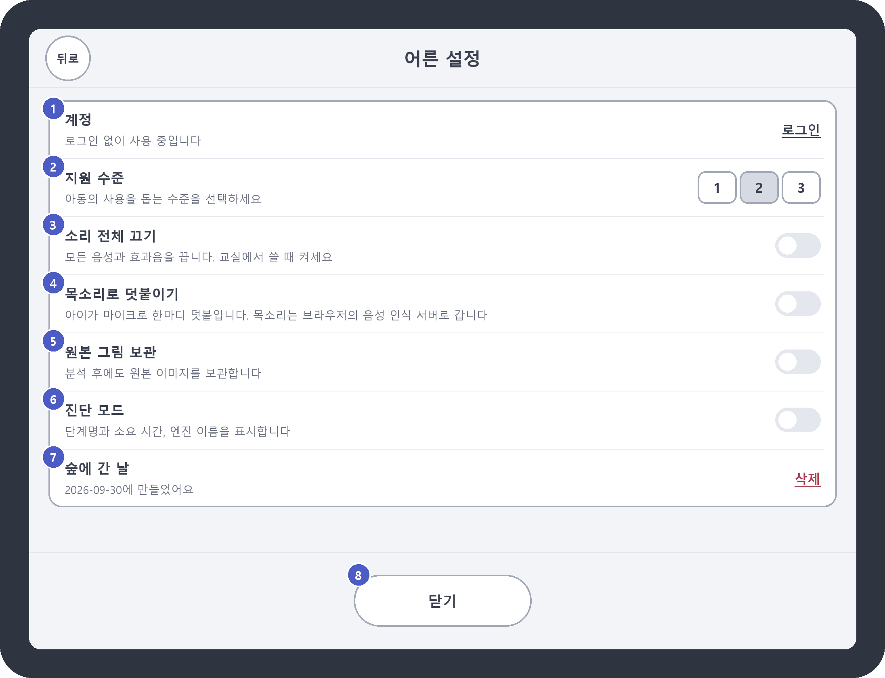

| No | 요소명 | 유형 | 상태 | 동작 및 예외 | 음성 |
|---|---|---|---|---|---|
| S-13-01 | 계정 | 행 + 링크 | 회원 / 비회원 | 회원이면 계정 이름과 「로그아웃」, 비회원이면 「로그인 없이 사용 중입니다」와 「로그인」 | 없음 |
| S-13-02 | 지원 수준 | 선택 1·2·3 | 기본 2 | 고르는 즉시 저장하고 모든 아동 화면에 반영한다 (2.1) | 없음 |
| S-13-03 | 소리 전체 끄기 | 토글 | 기본 꺼짐 | 켜면 모든 음성과 효과음을 끈다. 교실 사용을 위한 항목이다 | 없음 |
| S-13-04 | 목소리로 덧붙이기 | 토글 | **기본 꺼짐** | 켜면 S-07에서 말로 덧붙이기를 쓴다. 목소리가 어디로 가는지 설명을 함께 보인다. 브라우저가 지원하지 않으면 비활성 | 없음 |
| S-13-05 | 원본 그림 보관 | 토글 | 기본 꺼짐 | 꺼져 있으면 분석 후 원본을 서버에서 지운다. **지금은 설정만 저장되고 서버는 아직 지우지 않는다 → 9장** | 없음 |
| S-13-06 | 진단 모드 | 토글 | 기본 꺼짐 | 켜면 S-04·S-08에 상태, 소요 시간, 엔진 이름이 보인다 | 없음 |
| S-13-07 | 이야기 관리 | 목록 | 스크롤 | 저장된 이야기마다 「삭제」. 지우기 전에 확인을 한 번 받는다 | 없음 |
| S-13-08 | 닫기 | 버튼 | 항상 활성 | S-01로 돌아간다 | 없음 |

설정은 이 기기에 저장된다 (11.1). v0.2의 「앱 정보(버전·문의처)」는 아직 없다 → 9장.

---

### 6.15 S-14 처음 실행 (v0.3 신설, 어른)

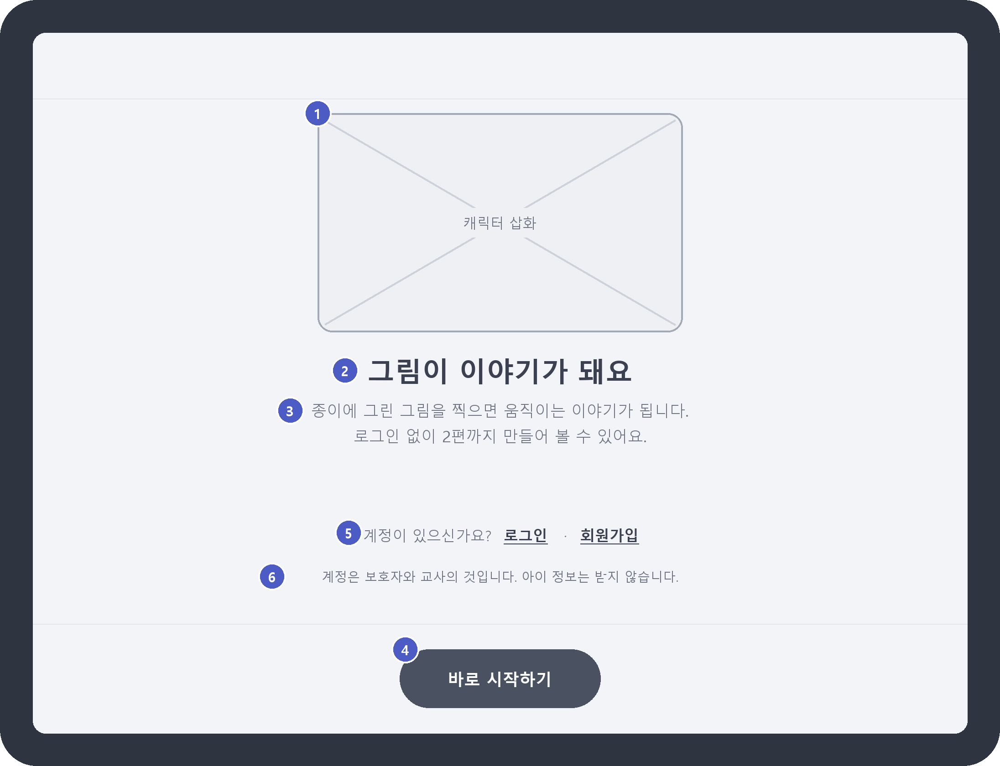

앱을 처음 열 때 한 번만 보인다. 보호자·교사가 보는 화면이다.

| No | 요소명 | 유형 | 상태 | 동작 및 예외 | 음성 |
|---|---|---|---|---|---|
| S-14-01 | 삽화 | 삽화 | 고정 | 손 흔드는 캐릭터 | 없음 |
| S-14-02 | 제목 | 텍스트 | 체험 남음 / 소진 | 「그림이 이야기가 돼요」 또는 「체험을 다 썼어요」 | 없음 |
| S-14-03 | 설명 | 텍스트 | 체험 남음 / 소진 | 「… 로그인 없이 N편까지 만들어 볼 수 있어요.」 또는 「로그인하면 이어서 만들 수 있어요. 지금까지 만든 이야기는 저장되지 않았습니다.」 | 없음 |
| S-14-04 | 바로 시작하기 / 로그인 | 큰 버튼 (주된 행동) | 체험 남음 / 소진 | 남았으면 비회원으로 시작해 S-01로, 소진이면 S-15로 | 없음 |
| S-14-05 | 로그인 · 회원가입 | 글자 링크 (C-07) | 항상 | S-15, S-16으로. 소진이면 회원가입만 | 없음 |
| S-14-06 | 계정 안내 | 텍스트 | 고정 | 「계정은 보호자와 교사의 것입니다. 아이 정보는 받지 않습니다.」 | 없음 |

**주된 행동은 「바로 시작하기」 하나다.** 가입을 앞에 세우면 이 서비스의 가장 강한 순간(내 그림이 움직이는 것)을 보여 주기 전에 사람이 나간다.

---

### 6.16 S-15 로그인 (v0.3 신설, 어른)

| 로그인 | 소셜 로그인에서 돌아오기 (S-15C) |
|---|---|
| 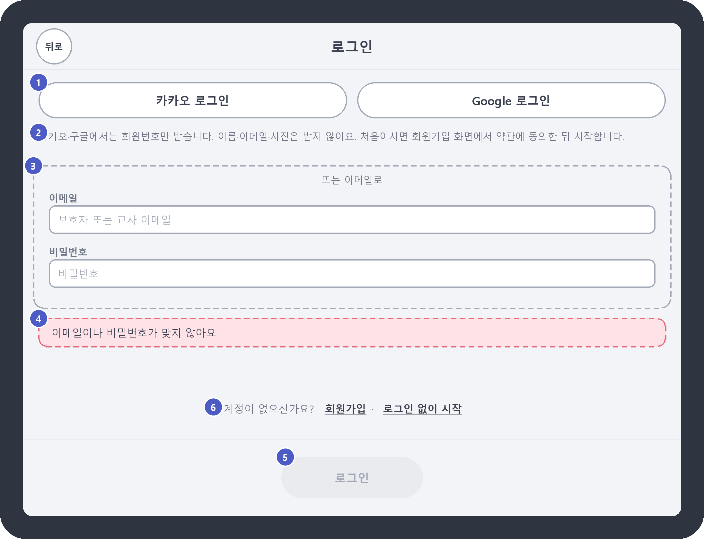 | 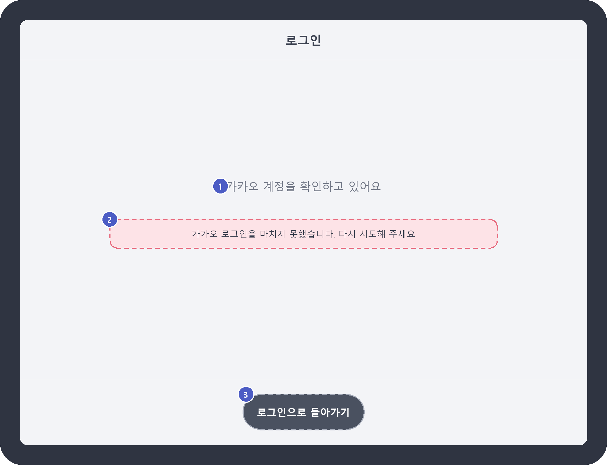 |

| No | 요소명 | 유형 | 상태 | 동작 및 예외 | 음성 |
|---|---|---|---|---|---|
| S-15-01 | 소셜 로그인 | 버튼 2개 | 항상 활성 | 카카오 · 구글. 제공자 로그인 화면으로 간다 | 없음 |
| S-15-02 | 수집 안내 | 텍스트 | 고정 | 「카카오·구글에서는 회원번호만 받습니다. 이름·이메일·사진은 받지 않아요. …」 | 없음 |
| S-15-03 | 이메일 로그인 | 입력 2개 | **목 엔진에서만 동작** | 이메일 · 비밀번호. 백엔드에 이메일 로그인이 없다 → 9장 | 없음 |
| S-15-04 | 오류 상자 | 상자 | 실패 시 | 「이메일이나 비밀번호가 맞지 않아요」. 어느 칸이 틀렸는지 구분해 알려 주지 않는다 | 없음 |
| S-15-05 | 로그인 | 큰 버튼 (주된 행동) | 두 칸이 차야 활성 | 처리 중에는 「확인하는 중」 | 없음 |
| S-15-06 | 회원가입 · 로그인 없이 시작 | 글자 링크 (C-07) | 항상 / 체험 남았을 때 | S-16으로, 또는 비회원으로 S-01로 | 없음 |

**S-15C 소셜 로그인에서 돌아오기** (`/auth/{provider}/callback`)

| No | 요소명 | 동작 |
|---|---|---|
| S-15C-01 | 확인 중 문구 | 「카카오 계정을 확인하고 있어요」. 제공자가 돌려준 인가 코드를 `POST /api/v1/auth/{provider}`로 보낸다 |
| S-15C-02 | 실패 상자 | 「카카오 로그인을 마치지 못했습니다. 다시 시도해 주세요」 |
| S-15C-03 | 로그인으로 돌아가기 | 실패했을 때만. S-15로 |

- 성공하면 S-01로. 제공자 화면에서 **취소**했으면 오류로 보이지 않고 S-15로 돌아간다
- **처음 온 사람**이면 서버가 `409 SIGNUP_REQUIRED`를 준다 → S-16으로, 어느 제공자였는지 들고 간다
- `state` 값은 프론트가 만들고 검증한다

---

### 6.17 S-16 회원가입 (v0.3 신설, 어른)

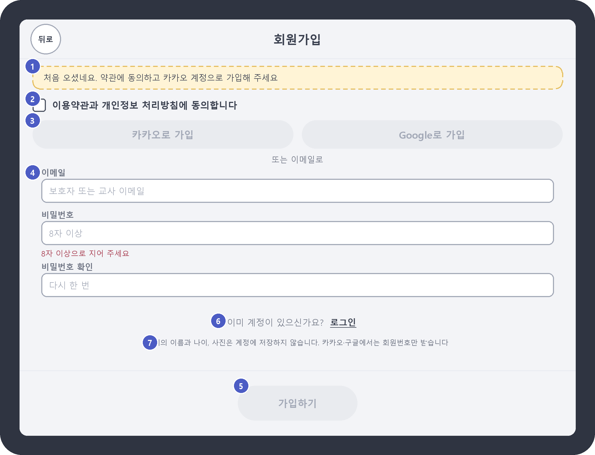

| No | 요소명 | 유형 | 상태 | 동작 및 예외 | 음성 |
|---|---|---|---|---|---|
| S-16-01 | 소셜에서 넘어온 안내 | 안내 상자 | S-15C에서 왔을 때만 | 「처음 오셨네요. 약관에 동의하고 카카오 계정으로 가입해 주세요」 | 없음 |
| S-16-02 | 약관 동의 | 체크박스 | 기본 꺼짐 | 「이용약관과 개인정보 처리방침에 동의합니다」. **가입 방법과 상관없이 먼저 받는다** | 없음 |
| S-16-03 | 소셜로 가입 | 버튼 2개 | 동의 전 비활성 | 카카오 · 구글. 돌아오면 `agreed: true`로 로그인해 계정이 만들어진다 | 없음 |
| S-16-04 | 이메일 가입 | 입력 3개 | 목 엔진에서만 동작 | 이메일 · 비밀번호(8자 이상) · 비밀번호 확인(같아야 함). 조건이 안 맞으면 칸 아래에 안내 | 없음 |
| S-16-05 | 가입하기 | 큰 버튼 (주된 행동) | 모든 조건 충족 시 활성 | 이메일 · 8자 이상 · 일치 · 동의 | 없음 |
| S-16-06 | 로그인 | 글자 링크 (C-07) | 항상 | S-15로 | 없음 |
| S-16-07 | 수집 안내 | 텍스트 | 고정 | 「아이의 이름과 나이, 사진은 계정에 저장하지 않습니다. …」 | 없음 |

제공자의 동의 화면은 제공자가 넘겨주는 항목에 대한 것이고, **우리 서비스 약관 동의를 대신하지 않는다.** 체크박스가 가리킬 이용약관·개인정보 처리방침 문서는 아직 없다 → 9장.

---

### 6.18 E-01 오류 공통

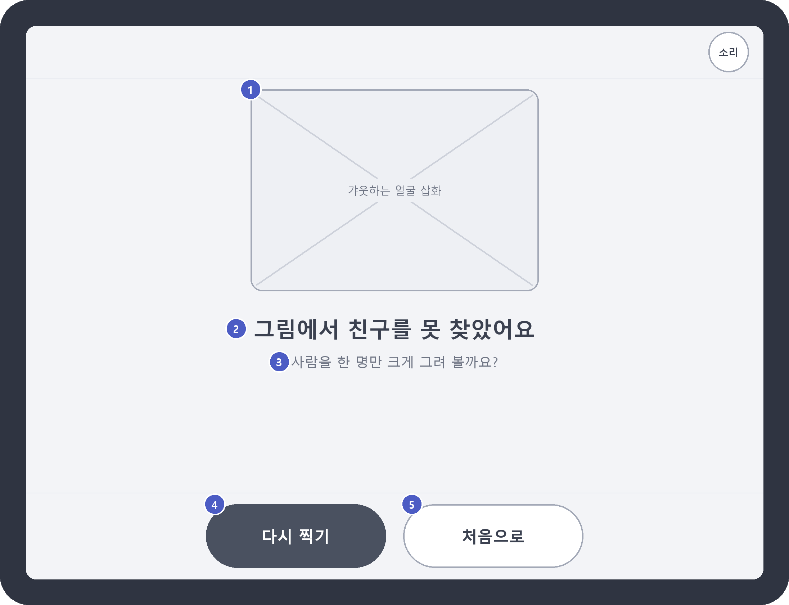

| No | 요소명 | 유형 | 상태 | 동작 및 예외 | 음성 |
|---|---|---|---|---|---|
| E-01-01 | 표정 삽화 | 삽화 | 고정 | 슬픔이 아니라 **갸웃하는** 표정. 아이가 자기 잘못으로 느끼지 않게 한다 | 없음 |
| E-01-02 | 오류 문장 | 텍스트 | 코드별 | 아래 표. 코드는 보이지 않는다 | 진입 시 자동 |
| E-01-03 | 보조 안내 | 텍스트 | 코드별 | 다시 할 때 무엇을 바꾸면 되는지 한 문장 | 없음 |
| E-01-04 | 1차 행동 | 큰 버튼 (주된 행동) | 항상 활성 | 코드별로 이동 (아래 표) | 없음 |
| E-01-05 | 처음으로 | 버튼 | 항상 활성 | S-01로 | 없음 |

| 화면 코드 | 오류 문장 | 보조 안내 | 1차 행동 → 이동 |
|---|---|---|---|
| `NO_CHARACTER` | 그림에서 친구를 못 찾았어요 | 사람을 한 명만 크게 그려 볼까요? | 다시 찍기 → S-03 |
| `MULTIPLE_CHARACTERS` | 친구가 여러 명이에요 | 한 명만 나오게 찍어 볼까요? | 다시 찍기 → S-03 |
| `LOW_CONFIDENCE` | 그림이 조금 흐릿해요 | 더 밝은 곳에서 찍어 볼까요? | 다시 찍기 → S-03 |
| `UNSUPPORTED_IMAGE` | 이 그림은 열 수 없어요 | 다른 그림을 골라 볼까요? | 앨범에서 고르기 → S-03 |
| `ENGINE_TIMEOUT` | 시간이 오래 걸리고 있어요 | 잠시 뒤에 다시 해 볼까요? | 다시 하기 → S-03 |
| `ENGINE_ERROR` | 잠깐 문제가 생겼어요 | 처음부터 다시 해 볼까요? | 처음으로 → S-01 |
| **`CONTENT_BLOCKED`** | **이 이야기는 만들 수 없어요** | **다른 카드를 골라 볼까요?** | **다시 고르기 → S-07.** 걸린 것은 대개 아이가 덧붙인 말이라, 덧붙인 말은 지우고 고른 카드는 둔다 |

**서버 오류 코드 → 화면 코드** (프론트 `src/api/index.ts` 한 곳에서 바꾼다)

| 서버 코드 | 화면 코드 |
|---|---|
| `NO_CHARACTER_DETECTED` | `NO_CHARACTER` |
| `INVALID_IMAGE`, `FILE_TOO_LARGE` | `UNSUPPORTED_IMAGE` |
| `AI_TIMEOUT`, 프론트 대기 시간 초과 | `ENGINE_TIMEOUT` |
| `CONTENT_BLOCKED` | `CONTENT_BLOCKED` |
| 그 밖의 모든 코드 | `ENGINE_ERROR` |

- 모달이 아니라 전체 화면으로 띄운다. 아이 화면에서 모달은 배경이 비쳐 혼란을 준다
- 서버의 `message`는 어른용 문장이라 아이 화면에 띄우지 않는다
- `MULTIPLE_CHARACTERS`·`LOW_CONFIDENCE`는 문구는 있지만 AI가 아직 이 경우를 걸러내지 않아 나오지 않는다 → 9장

---

## 7. 상태 처리 기준

| 상태 | 처리 |
|---|---|
| 로딩 | 500ms 미만이면 아무것도 표시하지 않는다 |
| 오래 걸리는 작업 | 분석·이야기 생성은 Job으로 돌리고 1.5초마다 상태를 묻는다. 분석 30초, 이야기 300초가 넘으면 `ENGINE_TIMEOUT` |
| 연결 끊김 | C-05 띠로 표시. 진행 중 작업은 중단하지 않는다 |
| 비어 있음 | 문장 하나와 다음 행동 버튼. 안내 문구만 두지 않는다 |
| 중복 입력 | 선택 후 300ms 입력 차단. 처리 중인 버튼은 연타를 막는다 |
| 부분 실패 | 음성이 없으면 브라우저 음성으로, 애니메이션이 없으면 그림으로 보여 준다. 이야기 전체를 실패로 만들지 않는다 |
| 새로고침 | 비회원도 같은 탭 안에서는 만들던 이야기가 남는다 (탭을 닫아야 사라진다) |
| 화면 회전 | 진행 중 선택과 재생 위치를 유지하고 캔버스 좌표만 다시 계산한다 |

---

## 8. 반응형 기준

| 화면 너비 | 구성 기준 |
|---|---|
| 1024px 이상 | 기준 레이아웃, 선택지 가로 배치 |
| 768~1023px | 선택지 2열 그리드 |
| 768px 미만 | 세로 배치, 캔버스 우선, 하단 버튼 고정 |

---

## 9. 아직 정하지 못한 것

| 항목 | 내용 | 누구와 |
|---|---|---|
| 관절 신뢰도 | AI 응답에 관절 `score`와 검출 `confidence`가 없다. 있어야 S-05-05를 조건부로, S-06에서 신뢰도 낮은 관절을 표시할 수 있다 | AI |
| 여러 명 · 흐릿함 걸러내기 | AI가 가장 높은 하나만 조용히 쓴다. `MULTIPLE_CHARACTERS`·`LOW_CONFIDENCE`가 나오지 않는다 | AI |
| 선택지를 누가 들고 있나 | 지금 프론트 목록 + 라벨 문자열 전송. 서버가 내려주면 아이콘 URL도 함께 온다 | 백엔드 · 기획 |
| 장면 배경 | 서버 렌더 MP4에 배경을 넣을지, 넣는다면 장소 × 분위기 몇 장인지 | AI · 기획 |
| 시도 기록 | S-10 순서 맞추기 결과를 받을 API가 없다 | 백엔드 |
| 원본 그림 삭제 | S-13-05가 꺼져 있으면 분석 후 지워야 하는데 서버가 아직 지우지 않는다. 아이 이름·얼굴이 찍힐 수 있다 | 백엔드 |
| 이메일 로그인 | 화면은 있고 백엔드는 없다. 남길지, 소셜만 둘지 (비밀번호를 보관하면 지킬 것이 늘어난다) | 전원 |
| 계정에 이야기 묶기 | 로그인해도 아직 어떤 API도 토큰을 쓰지 않는다. 회원 이야기도 기기에만 있다 | 전원 |
| 약관 · 개인정보 처리방침 | S-16-02가 가리킬 문서가 없다 | 기획 |
| S-04 되돌리기 | 지금은 보이고 그만하기와 같다. 원칙대로 숨길지 | 프론트 |
| S-02 예시 크게 보기 | v0.2의 「누르면 전체 화면으로 확대」가 아직 없다 | 프론트 |
| S-03 형식 · 용량 안내 | 10MB 초과나 이미지가 아닌 파일을 안내 없이 무시한다 | 프론트 |
| S-06 초기화 | 자동 추정값으로 되돌리는 버튼이 없다 (지금은 C-01로 나갔다 오면 된다) | 프론트 |
| S-13 앱 정보 | 버전과 문의처 | 프론트 |
| S-03D 2단계 | 부위별로 그렸으니 관절 자리를 프론트가 이미 안다. AI 추정 없이 이 관절로 렌더하는 경로 | 프론트 · 백엔드 · AI |
| 효과음 | 선택·성공 효과음을 넣을지 | 기획 |

v0.2 9장의 「순서 맞추기 판정 시점」은 **4칸을 다 채운 뒤**로, 「이야기 저장 단위」는 **비회원 기기 단위 + 선택적 로그인**으로 정했다.

---

## 10. 서버 연동 요약

계약의 원본은 백엔드 `docs/api-contract.md`다. 여기는 화면에서 무엇을 언제 부르는지만 적는다.

| 화면 | 요청 | 언제 | 받는 것 |
|---|---|---|---|
| S-04 | `POST /api/v1/characters` (multipart `image`) | 들어오자마자 | `character_id`, `job_id` |
| S-04, S-08 | `GET /api/v1/jobs/{job_id}` | 1.5초마다, `succeeded`·`failed`까지 | `status`, `error.code` |
| S-04 | `GET /api/v1/characters/{id}` | 분석이 끝나면 | 이미지 크기, 관절 15개 |
| S-06 | `PATCH /api/v1/characters/{id}/joints` | 「다 했어요」, 옮긴 관절이 있을 때 | 보정된 캐릭터 |
| S-08 | `POST /api/v1/stories` | 들어오자마자 | `story_id`, `job_id` |
| S-08 | `GET /api/v1/stories/{id}` | 생성이 끝나면 | `text`, `audio_url`, `animation_url` |
| S-15C | `POST /api/v1/auth/{provider}` | 제공자에서 돌아오면 | `token`, `account` |

**좌표.** 서버는 **원본 그림의 픽셀 좌표**(왼쪽 위 원점)를 쓴다. 프론트는 받자마자 0~1로 바꿔 화면에 맞게 그리고, 보낼 때는 다시 원본 픽셀로 바꾼다.

**이야기 네 칸.** 각 칸은 자유 문자열 50자다. 카드 라벨을 보내고, 말로 덧붙인 칸은 아이 말을 보낸다.

**엔진 전환.** `VITE_ENGINE=mock`이면 서버 없이 흐름이 끝까지 돈다. 화면 코드는 이 값을 모른다. 모든 서버 호출은 `src/api/index.ts` 한 곳을 지난다.

---

## 11. 계정과 데이터

v0.2 코드 주석이 가리키던 「설계서 11장」을 이번에 채운다.

- **계정은 보호자·교사의 것이다. 아이는 로그인하지 않는다.**
- 로그인은 앱 첫 실행(S-14)에만 묻고, 이후에는 바로 S-01로 간다
- 로그인은 선택이다. 비회원도 모든 기능을 쓴다

### 11.1 무엇을 어디에 두나

| 무엇 | 비회원 | 회원 | 비고 |
|---|---|---|---|
| 로그인 토큰 | 없음 | 브라우저 `localStorage` | 서버에는 SHA-256 해시만. 기본 30일 |
| 비회원 표시 | `sessionStorage` | 없음 | 탭을 닫으면 사라진다 |
| 만든 이야기 목록 | `sessionStorage` | `localStorage` | 비회원은 탭을 닫으면 함께 사라진다 |
| 어른 설정 | `localStorage` | `localStorage` | 지원 수준, 소리, 목소리, 원본 보관, 진단 |
| 체험 사용 수 | `localStorage` 정수 하나 | 없음 | 이야기 내용과 그림은 남기지 않는다 |
| 그림 · 관절 · 이야기 · 음성 · 영상 | 서버 | 서버 | 지금은 계정과 묶이지 않는다 (9장) |

- 비회원 데이터를 지우려고 `pagehide`에서 따로 지우지 않는다. 새로고침에도 `pagehide`가 발생해서 만들던 이야기가 통째로 사라졌기 때문이다. 「탭을 닫으면 사라진다」는 `sessionStorage` 자체가 보장한다
- 로그아웃하면 토큰, 계정 이름, `sessionStorage`, 체험 사용 수를 모두 지운다

### 11.2 비회원 체험 한도

- **기기당 2편** (`store/auth.ts`의 `TRIAL_LIMIT`)
- 이야기가 **성공했을 때** 한 편을 센다 (S-08)
- 만드는 도중에 끊지 않는다. S-01에서 「이야기 만들기」를 누를 때만 확인하고, 다 썼으면 S-14로 보낸다
- 아이 화면에서 막지 않는다. 전환 안내는 S-11에서 한 번만 띄운다

### 11.3 받지 않는 것

- 카카오·구글에서는 **회원번호만** 받는다. 이름·이메일·프로필 사진은 받지도 저장하지도 않는다 (동의 항목을 요청하지 않는다. 구글은 `openid`만)
- 아이의 이름·나이·사진은 계정에 저장하지 않는다
- 아이 목소리는 녹음 파일로 남기지 않는다. 글자로 바뀐 말(50자)만 이야기에 들어간다

---

## 12. v0.2 → v0.3 변경 이력

| 구분 | 화면 | 바뀐 것 |
|---|---|---|
| 신설 | S-03D | 화면에 그리기 (머리 → 몸 → 팔 → 다리, 도장, 떨어짐 검사) |
| 신설 | S-14 · S-15 · S-15C · S-16 | 처음 실행, 소셜 로그인(카카오·구글), 가입과 약관 동의 |
| 신설 | 10장 · 11장 | 서버 연동 요약, 계정과 데이터 |
| 신설 | 2.2 · C-07 | 아이 화면과 어른 화면, 곁들이는 링크 줄 |
| 변경 | S-02 | 「이러면 더 잘 움직여요 — 팔다리 띄우기」 카드 추가 |
| 변경 | S-03 | 「화면에 그리기」 추가, 업로드 진행 표시 삭제 (S-04에서 기다림) |
| 변경 | S-04 · S-08 | SSE 단계 대신 Job 상태 polling(1.5초), 단계 점 3개 |
| 변경 | S-05 | 도움 링크를 늘 노출 (신뢰도 값 없음) |
| 변경 | S-06 | 관절 16개 → **15개**, 머리 관절 없음, 「옮김」 표시, 저장하지 않고 나가기 |
| 변경 | S-07 | 말로 덧붙이기(「더 말해 볼래요?」) 추가, 결과 단계 앞 칸 요약, 선택지 목록 확정 |
| 변경 | S-09 | 장면 4개 → **서버 렌더 MP4 하나 + 문장 짚기** |
| 변경 | S-10 | 장면 카드 → **문장 카드**, 시도 기록 전송 없음 |
| 변경 | S-11 | 비회원 안내 추가 |
| 변경 | S-13 | 계정 행, 목소리로 덧붙이기 토글 추가 |
| 변경 | E-01 | `CONTENT_BLOCKED` 추가, 서버 코드 대응표 |
| 변경 | 9장 | 정한 것 정리, 새로 열린 것 추가 |
